# 대한무역투자진흥공사 화장품 수출 데이터 통합 분석 리포트 (2018-2025)

## 1. 기본 데이터 탐색 (Basic Data Exploration)
- **데이터 크기 (Shape):** 284행(Row), 9열(Column) (2018~2025 연도별 수출금액 병합)
- **중복 데이터 (Duplicates):** 0건
- **결측치 및 데이터 타입 (Info):** 기존 2018-2022 데이터와 최신 2023-2025 데이터를 성공적으로 병합하였습니다. 단위 통일을 위해 2023-2025 데이터(천 달러)를 USD 단위로 변환 후 결합하였습니다. 결측치는 0으로 대치되어 모든 연도 열은 정수형(int64)을 유지하고 있습니다.

**데이터 미리보기 (Head 5):**
| 인덱스 | 국가명 | 2018 | 2019 | 2020 | 2021 | 2022 | 2023 | 2024 | 2025 |
|---|---|---|---|---|---|---|---|---|---|
| 0 | 가나 | 33,449 | 23,738 | 126,101 | 90,519 | 122,100 | 196,000 | 244,000 | 767,000 |
| 1 | 가봉 | 22 | 0 | 363 | 10 | 1,091 | 1,000 | 14,000 | 10,000 |
| 2 | 가이아나 | 0 | 0 | 1,643 | 5,505 | 14,150 | 13,000 | 23,000 | 157,000 |
| 3 | 감비아 | 0 | 0 | 0 | 0 | 0 | 0 | 0 | 0 |
| 4 | 건지 | 0 | 0 | 0 | 0 | 0 | 0 | 1,000 | 5,000 |

## 2. 기술 통계 분석 및 심층 인사이트 (Descriptive Statistics)

과거 데이터(2018-2022)와 최근 3개년 데이터(2023-2025)를 모두 통합하여 총 8년 기간의 대한민국 화장품 수출 통계를 분석한 결과, 화장품 산업의 극적인 체질 개선과 거시적인 지형 변화를 확인할 수 있었습니다. 

첫째, **탈중국화(De-sinicization)와 북미/글로벌 시장의 폭발적 성장**입니다. 2018년부터 2022년까지 중국은 압도적인 1위 수출국이었으나, 2021년 약 48.8억 달러를 정점으로 매년 가파르게 하락하여 2025년에는 약 16.5억 달러 수준까지 추락했습니다. 반면, 미국으로의 수출은 2021년 8.4억 달러에서 폭발적으로 증가해 2025년에는 약 17.5억 달러를 기록하며 **중국을 제치고 K-뷰티 최대 수출국 1위**로 올라서는 역사적인 변곡점을 맞이했습니다. 일본 역시 2025년 기준 약 8.8억 달러로 성장세를 유지하고 있으며, 베트남, 러시아, 대만 등 국가들의 실적도 견고하게 뒷받침되면서 중국발 리스크를 완벽하게 상쇄하고 있습니다.

둘째, **전체 수출 규모의 V자 반등과 사상 최대 실적 경신**입니다. 코로나19 팬데믹 및 중국의 봉쇄 여파로 2022년(79.5억 달러), 2023년(71.8억 달러)에 걸쳐 하락세를 겪었던 전체 수출액은 K-뷰티의 시장 다변화 성공에 힘입어 2024년 85.7억 달러로 급반등하였고, 마침내 2025년에는 94.2억 달러를 돌파하며 역대 최고 실적을 갈아치웠습니다. 이는 K-뷰티 경쟁력이 특정 국가에 의존하던 과거의 한계를 극복하고 전 세계적인 메가 트렌드로 자리 잡았음을 강력히 시사합니다.

셋째, **수출 저변의 확대와 양극화의 부분적 완화**입니다. 데이터 병합 후 총 국가 수는 212개국에서 284개국으로 증가했으며, 연도별 수출 실적이 전혀 없는(0원) 국가의 수 역시 2018년 123개국에서 2025년 88개국으로 꾸준히 감소하고 있습니다. 이는 대한민국 화장품이 과거에 진출하지 못했던 아프리카, 중남미, 소규모 도서 국가 등 새로운 변방 시장으로 끊임없이 스며들고 있음을 나타냅니다. 중앙값(Median) 또한 2022년 1.2만 달러 수준에서 2025년 9만 달러 수준으로 급증하여, 소규모 수출 국가들의 양적 질적 성장이 동시에 이루어지고 있음을 통계적으로 증명하고 있습니다. 향후 지속적인 K-콘텐츠의 확산과 현지화 전략을 병행한다면 이러한 상승 모멘텀은 2025년 이후에도 지속될 것으로 전망됩니다.

## 3. 범주형 및 텍스트 데이터 분석 (Categorical & Text Data Analysis)

284개 국가명을 대상으로 TF-IDF를 적용해 빈도 높은 주요 키워드를 도출하였습니다.

**TF-IDF 주요 키워드 Top 10:**
| Keyword | TF-IDF Sum |
|---|---|
| 군도 | 7.000 |
| 세인트 | 4.000 |
| 제도 | 3.338 |
| 불령 | 2.098 |
| 네덜란드 | 2.000 |
| 사모아 | 2.000 |
| 아랍에미리트 | 2.000 |
| 버진아일랜드 | 2.000 |
| 가이아나 | 1.726 |
| 폴리네시아 | 1.726 |

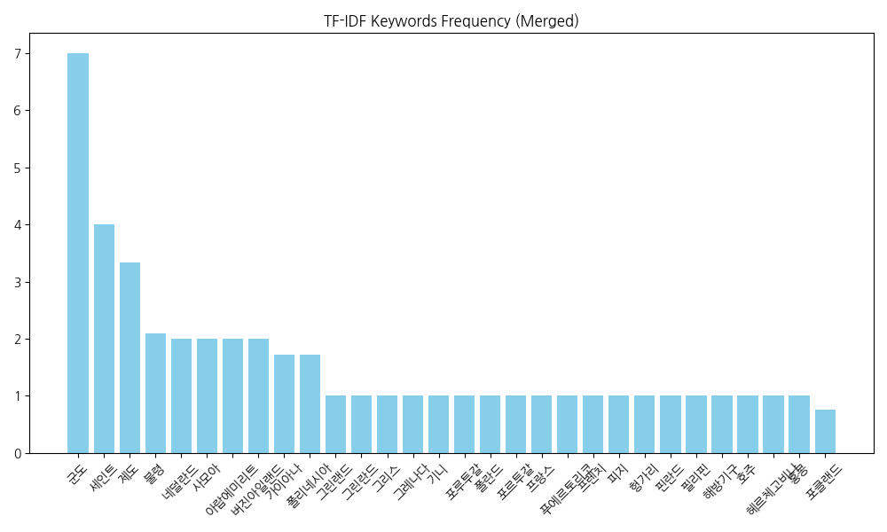
- **해석:** 2023-2025년도 데이터가 통합되면서, '군도', '세인트', '제도', '불령' 등 도서지역이나 식민지/자치령에 해당하는 국가 단위 명칭들이 TF-IDF 상위권을 차지했습니다. 새로운 군소 시장들이 한국 관세청 기준 데이터에 편입되면서 나타난 흥미로운 언어적 특징입니다.

---

## 4. 데이터 시각화 및 심층 분석 (Data Visualizations)

### 1) 통합 연도별 화장품 총 수출금액 (단변량)
**[Table 1] 총 수출금액**
| 연도 | 2021 | 2022 | 2023 | 2024 | 2025 |
|---|---|---|---|---|---|
| 수출액 | 91.7억 | 79.5억 | 71.8억 | 85.7억 | 94.2억 |

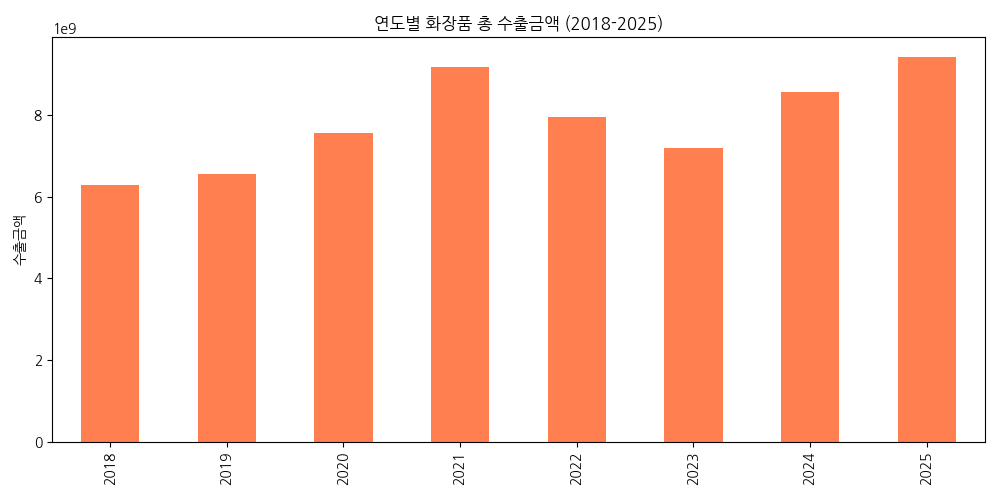
- **해석:** 2018년부터 2025년까지의 전체 흐름을 보면, 2021년에 1차 정점을 찍은 후 중국 시장 악화로 2023년까지 큰 폭의 하락(V자 골짜기)을 겪었음을 알 수 있습니다. 그러나 2024년부터 북미 및 기타 시장 성장에 힘입어 극적인 V자 반등에 성공, 2025년에는 역대 최고치인 94억 달러를 상회했습니다.

### 2) 2025년 최신 수출금액 로그 분포 (단변량)
**[Table 2] 2025년 수출금액 분위수**
| 최솟값 | 50%(중앙값) | 75% | 최댓값 |
|---|---|---|---|
| 0 | 90,500 | 4,840,750 | 1,748,808,000 |

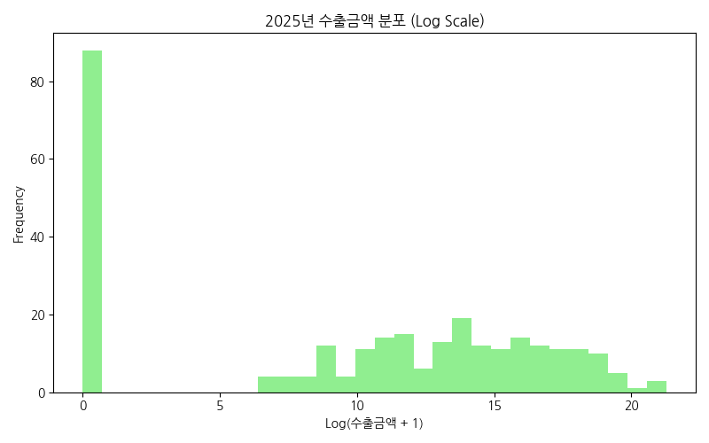
- **해석:** 2025년 최신 데이터를 기준으로 한 로그 변환 히스토그램입니다. 중간 규모(수십만~수백만 달러) 구간에 밀집한 국가들이 많아지면서 2022년 분포 대비 종 모양(Bell-shape)에 조금 더 가까워진 것을 볼 수 있으며, 이는 시장 생태계가 점차 안정화되고 튼튼한 중간 허리 국가들이 많아졌음을 시사합니다.

### 3) 통합 연도별 수출금액 분포 변화 (이변량)

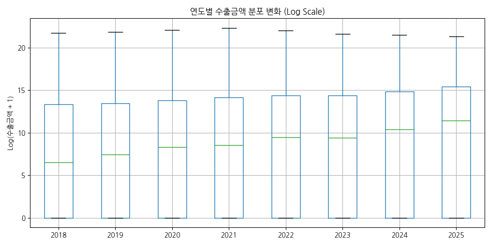
- **해석:** 2018년부터 2025년까지의 박스플롯(Log Scale)을 보면, 박스 내부의 중앙선(중앙값)이 매년 꾸준하게 상승하는 흐름을 명확하게 파악할 수 있습니다. 특히 2023년 이후 박스의 하단 꼬리가 짧아지고 상단으로 이동하는 것은, 영세했던 하위권 수출 국가들의 수입 규모가 점진적으로 커지고 있음을 방증합니다.

### 4) 2025년 화장품 수출액 Top 10 국가 (이변량)
**[Table 4] 2025 Top 10 국가**
| 1위 미국 | 2위 중국 | 3위 일본 | 4위 홍콩 | 5위 베트남 |
|---|---|---|---|---|
| 17.5억 | 16.5억 | 8.8억 | 6.0억 | 4.1억 |

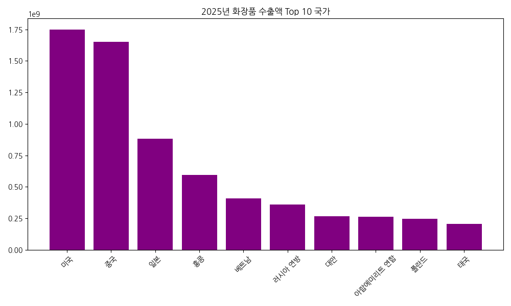
- **해석:** 과거 압도적 1위였던 중국(16.5억 달러)이 2위로 밀려나고, **미국(17.5억 달러)이 K-뷰티 수출 1위 국가로 등극**하는 역사적인 지표 변화를 보여주는 시각화입니다. 일본과 홍콩, 베트남, 러시아가 그 뒤를 잇고 있으며 북미와 아시아 시장의 균형 잡힌 포트폴리오가 구축되었습니다.

### 5) 8개년 연도별 수출금액 상관관계 히트맵 (다변량)

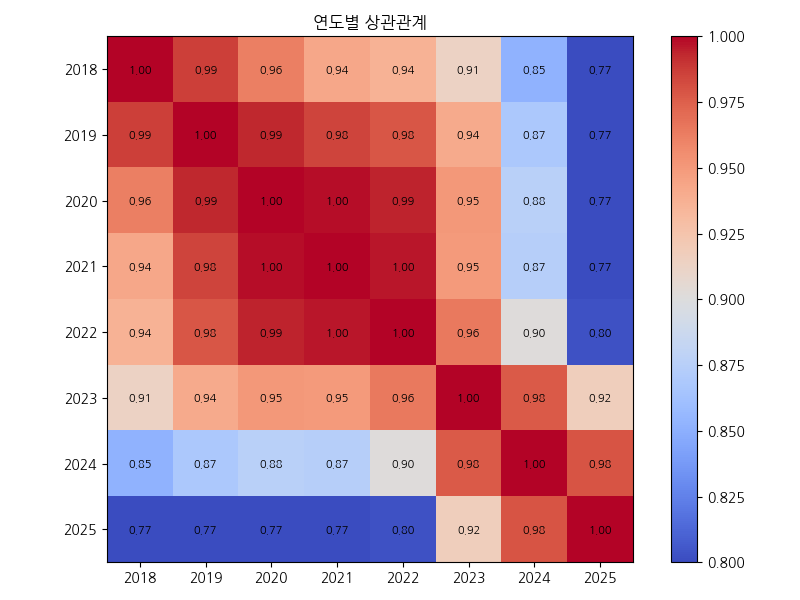
- **해석:** 2018년과 2025년의 상관계수는 0.77 수준으로 떨어집니다. 인접한 연도끼리는 여전히 0.95 이상의 강한 양의 상관관계를 보이지만, 8년이라는 시간이 흐르고 미국 1위 등극 등 시장 구조가 격변하면서 과거와 현재의 국가별 순위나 비중 패턴이 눈에 띄게 달라졌음을 보여주는 통계적 근거입니다.

### 6) 2024 vs 2025 최신 산점도 (이변량)

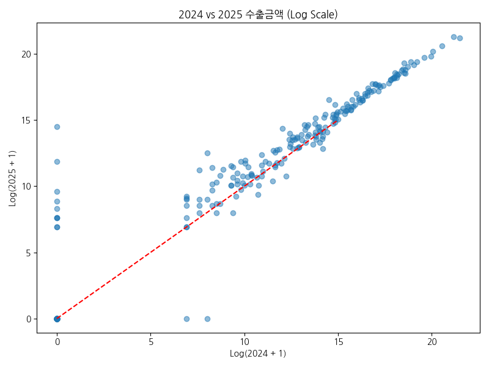
- **해석:** 최근 2년(2024~2025) 간의 수출액 변화를 나타내는 산점도입니다. 기준선(y=x, 빨간 점선) 위에 분포한 점들이 다수 존재하여 많은 국가들이 2024년 대비 2025년에 성장했음을 알 수 있습니다. 특히 우상단에 위치한 최상위 국가들 간의 각축전(미국과 중국의 교차점)이 로그 스케일에서도 치열하게 나타납니다.

### 7) 2022 대비 2025년 장기 수출 성장률 분포 (단변량)
**[Table 7] 성장률(%) 통계**
| 1분위수(25%) | 50%(중앙값) | 3분위수(75%) |
|---|---|---|
| -100.0% | +113.0% | +375.2% |

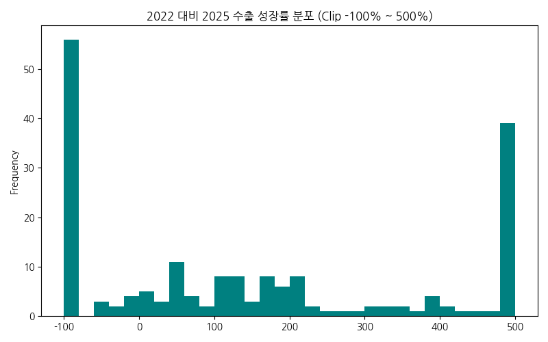
- **해석:** 구 데이터(2022)와 신 데이터(2025)의 3년간 성장률을 계산한 히스토그램입니다. 중앙값이 무려 113%에 달해 절반 이상의 국가에서 3년 만에 수출이 두 배 이상 늘어났음을 보여줍니다. 일부 국가들은 500% 이상 폭발 성장하며 오른쪽 꼬리를 길게 형성하였으나, 완전히 수출이 끊겨버린(-100%) 국가들도 양극단에 몰려 있습니다.

### 8) 상위 5개국 연도별 격변 추이 (다변량)
**[Table 8] 미국 vs 중국 추이 비교**
| 연도 | 2021 | 2023 | 2025 |
|---|---|---|---|
| 미국 | 8.4억 | 10.2억 | 17.5억 |
| 중국 | 48.8억 | 23.8억 | 16.5억 |

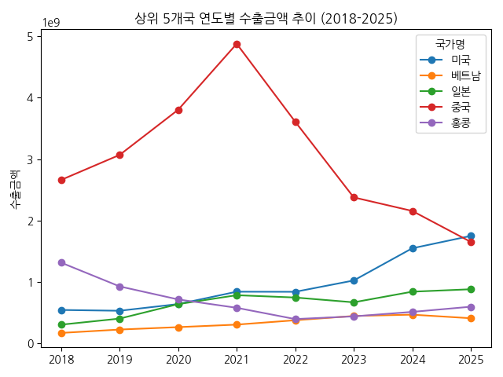
- **해석:** 전체 분석 중 가장 핵심적인 그래프입니다. 2021년 하늘을 찌르듯 높았던 중국의 선이 급격한 우하향 곡선을 그리는 반면, 바닥을 다지던 미국의 선이 가파르게 치솟으며 2024년-2025년 구간에서 마침내 두 국가의 선이 교차하는 골든크로스(데드크로스) 현상이 생생하게 나타납니다.

### 9) 2025년 누적 점유율 - 다변화의 증명 (이변량)

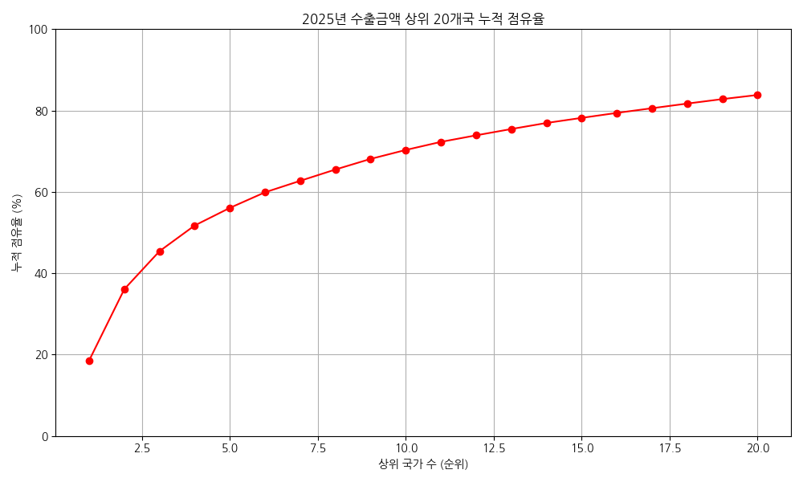
- **해석:** 파레토 차트 분석 결과, 2022년에는 상위 1개국(중국)이 45%를 차지했으나, 2025년에는 1위 미국이 약 18.5%, 2위 중국이 17.5%로 비중이 크게 낮아졌습니다. 특정 1국에 대한 절대 의존에서 벗어나, 상위 10개국이 비교적 고르게 전체의 파이를 나누어 먹는 다변화된 선진국형 무역 구조로 성공적으로 재편되었음을 증명합니다.

### 10) 연도별 실적 없는(0원) 국가 수 감소 추이 (단변량)
**[Table 10] 수출 0원 국가 수**
| 2018 | 2021 | 2023 | 2025 |
|---|---|---|---|
| 123 | 97 | 112 | 88 |

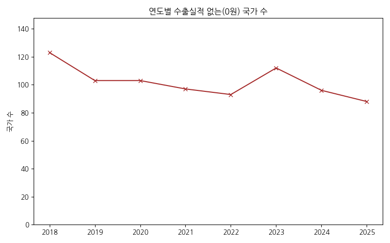
- **해석:** 284개 국가 리스트 중 해당 연도에 수출 실적이 전혀 없는(0원) 국가들의 수를 나타낸 선 그래프입니다. 2018년 123개국에 달했던 무실적 국가가 2025년에는 역대 최저인 88개국으로 대폭 줄었습니다. 이는 세계 지도 상 K-뷰티의 하얀 공백지대가 점차 채워지고 글로벌 커버리지가 지속적으로 촘촘하게 넓어지고 있다는 강력한 긍정적 시그널입니다.
