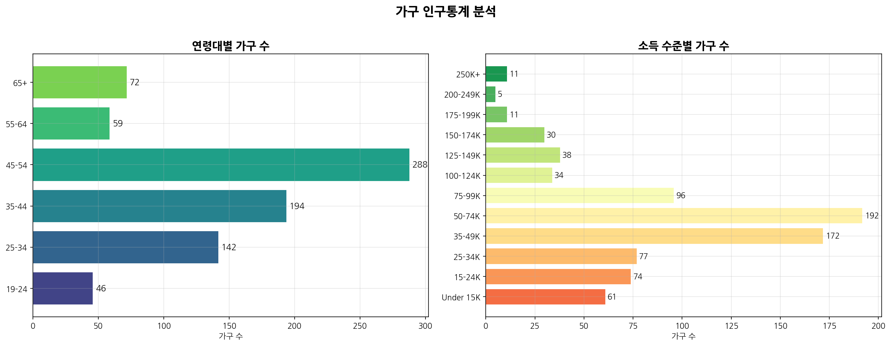
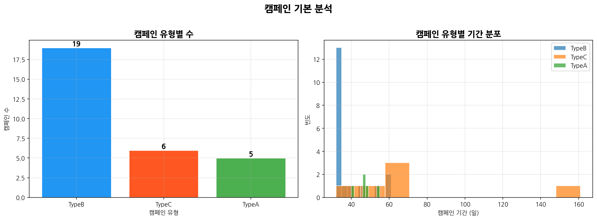
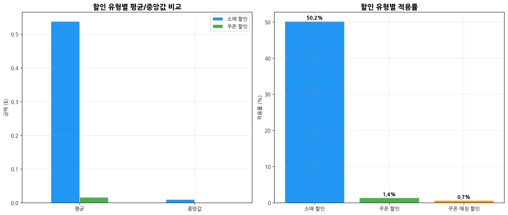
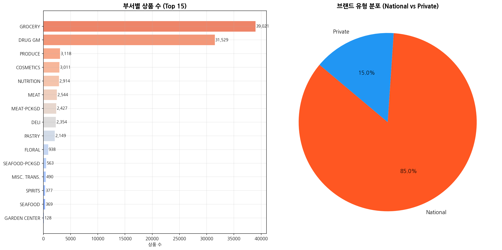
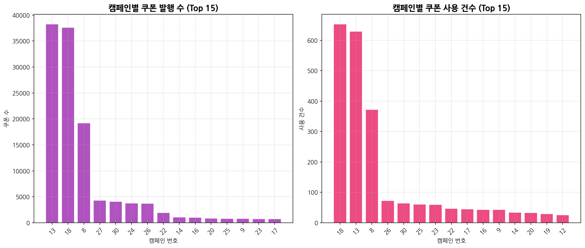
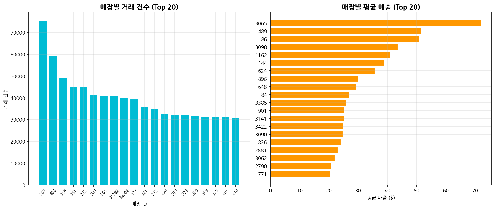
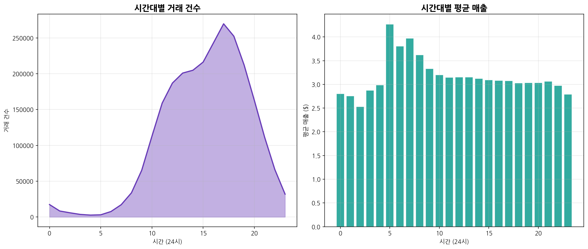
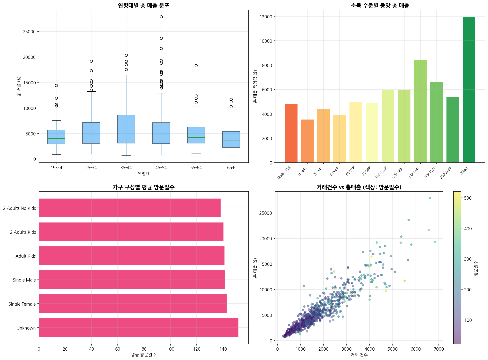
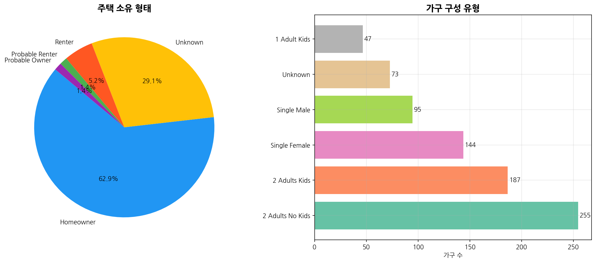

# <i class="fa-solid fa-chart-line"></i> 소매 유통 마케팅 및 대시보드 통합 분석
## 데이터 기반 고객 구매 행동, 마케팅 효율 검증 및 대시보드 구현 명세

* **분석 대상:** Dunnhumby "The Complete Journey" 데이터셋 (260만 건 거래, 2,500가구)
* **주요 과제:** RFM 고객 세분화, 이탈 고객 행동 분석, 시장 장바구니 연관 관계 분석, 마케팅 ROI 최적화
* **디자인 콘셉트:** Nordic Minimalist (노르딕 블루 & 스노우 윈드)
* **발표자:** 안티그레비티 분석팀

소매 유통 마케팅 및 대시보드 통합 분석 리포트

<!--
안녕하세요. 오늘 발표를 맡은 안티그레비티 분석팀입니다. 본 발표에서는 Dunnhumby의 "The Complete Journey" 데이터셋을 바탕으로 진행한 소매 유통 마케팅 성과 및 고객 세분화 분석 결과와 이를 시각화하여 비즈니스 의사결정을 실시간으로 지원하기 위해 개발한 파이썬 스트림릿 대시보드의 구현 명세를 종합적으로 보고해 드리고자 합니다. 본 데이터셋은 총 260만 건의 거래 데이터와 801가구의 정밀 인구통계 정보를 포함하고 있으며, 분석을 통해 마케팅 캠페인의 실질적 성과와 고객 이탈의 비용 규모, 그리고 상품 배치 시너지를 정량적으로 규명하였습니다. 약 20분에 걸친 이 발표를 통해, 데이터에 숨겨진 고객의 행동 패턴을 이해하고 어떻게 하면 한정된 마케팅 리소스를 가장 효율적으로 배분하여 궁극적인 비즈니스 매출 성장을 이끌어낼 수 있을지 구체적인 데이터 기반 전략을 제시하겠습니다. 경청해 주시면 감사하겠습니다.
-->

---

# <i class="fa-solid fa-list-ol"></i> 발표 목차 (Table of Contents)
## 데이터 기반 의사결정을 위한 20개 핵심 파트 구성

  
01. 분석 및 대시보드 구축 목표

  
02. 데이터셋 및 표본 대표성 검증

  
03. RFM 고객 세그먼트 설계 및 분포

  
04. 이탈 고객군 vs 활동 고객군 격차 분석

  
05. 시장 장바구니 연관 분석 (MBA) 규칙

  
06. 인접 진열 및 교차 판매 전략 제안

  
07. 캠페인 빈도와 매출의 상관성 검증

  
08. 쿠폰 사용의 매출 리프트 효과 분석

  
09. 대시보드 구현 명세 및 탭 구성

  
10. TAB 1: 홈 / 통합 성과 분석

  
11. TAB 2: 고객 / RFM 세분화 & 이탈 전략

  
12. TAB 3: 상품 / 시장 장바구니 분석(MBA)

  
13. TAB 4: 전략 / 마케팅 & 쿠폰 효율

  
14. TAB 5: 상세 EDA - 인구통계 분석

  
15. TAB 5: 상세 EDA - 매장 및 시간대별 성과

  
16. TAB 5: 상세 EDA - 할인 패턴 및 카테고리

  
17. TAB 5: 상세 EDA - 캠페인 효율 및 프로모션

  
18. TAB 5: 상세 EDA - 피로도 및 일정 분석

  
19. 종합 요약 및 비즈니스 액션 플랜

  
20. 질의응답 및 맺음말

소매 유통 마케팅 및 대시보드 통합 분석 리포트

<!--
발표의 전체적인 목차를 소개해 드리겠습니다. 오늘 발표는 기초 분석 단계부터 상세 시각화 대시보드 해석, 그리고 최종 액션 플랜 제안까지 총 20개의 슬라이드로 구성되어 있습니다. 우선 1부에서는 프로젝트의 구체적인 목표와 데이터셋 표본 검증 결과를 짚어본 후, RFM 기반의 고객 세분화 및 이탈 격차 분석, 그리고 장바구니 분석에 기반한 진열 전략을 확인하겠습니다. 2부에서는 캠페인 횟수와 매출의 상관관계, 쿠폰 사용에 따른 가치 증대 효과를 정량적으로 증명한 마케팅 성과 분석 결과를 보고하겠습니다. 3부에서는 이 모든 통찰을 담아 파이썬 스트림릿으로 구현한 통합 대시보드의 각 탭별 구조와 27개 핵심 그래프에 대한 실무 해석 방법론을 다룹니다. 마지막 4부에서는 이를 종합하여 현업에서 즉시 실행할 수 있는 우선순위별 비즈니스 액션 플랜을 제언하며 마무리하도록 하겠습니다.
-->

---

# <i class="fa-solid fa-bullseye"></i> 01. 분석 및 대시보드 구축 목표
## 데이터 기반 비즈니스 지표 최적화와 실질적 마진 보전 전략

* **종합 성과 모니터링 체계 구축:**
  * 매출액, 활성 가구수, 객단가(AOV) 등 핵심 비즈니스 지표의 시계열 추이 추적
* **고객 생애 가치(LTV) 극대화 및 이탈 방어:**
  * RFM 세분화를 통해 VIP 고객을 식별하고 이탈 우려 고객 대상의 리텐션 오퍼 설계
* **마케팅 ROI 최적화 및 비용 효율화:**
  * 캠페인 노출과 매출 간의 양의 상관성 검증 및 비효율적 할인 구조 개선
* **상품 진열 및 교차 판매 시너지 창출:**
  * 장바구니 연관 규칙 분석(MBA) 결과를 반영한 오프라인 매장 매대 및 동선 설계 지원

소매 유통 마케팅 및 대시보드 통합 분석 리포트

<!--
첫 번째 파트로, 본 분석 프로젝트 및 실시간 모니터링 대시보드 구축의 궁극적인 비즈니스 목적을 설명해 드리겠습니다. 유통 마케팅의 고도화는 매출 극대화와 마진 방어라는 두 가지 상충되는 목표를 효율적으로 조율하는 데 있습니다. 본 대시보드는 상시적으로 낭비되는 일반 소매 할인을 제어하고, 대신 가치 창출이 명확한 타겟 마케팅으로의 전환을 지원하고자 구축되었습니다. 이를 위해 첫째, 비즈니스의 전반적인 건강 상태를 보여주는 핵심 지표들을 일 단위, 주 단위로 모니터링할 수 있는 대시보드 체계를 수립했습니다. 둘째, 고객의 생애 가치를 극대화하고 이탈 비용을 최소화하기 위한 RFM 분석 모듈을 탑재했습니다. 셋째, 캠페인 투자 대비 매출 ROI를 정량적으로 분석하고 비용 누수를 모니터링합니다. 마지막으로 상품 간의 연관 구매 데이터를 바탕으로 매장 매대를 과학적으로 구성할 수 있는 가이드를 제시하여 실질적인 매출 증대를 달성하고자 합니다.
-->

---

# <i class="fa-solid fa-database"></i> 02. 데이터셋 및 표본 대표성 검증
## 8개 데이터셋 연계 구조와 인구통계 표본 편향 극복을 위한 검정(T-Test)

* **데이터셋 구성 (총 8개 테이블 연계):**
  * 거래 내역: 2,595,732행 (가구별 구매수량, 매출액, 할인 정보)
  * 인구통계 정보: 801가구 (연령대, 소득, 가구 크기, 소유 여부)
  * 마케팅 이력: 캠페인 정보, 쿠폰 매핑 정보, 실제 쿠폰 사용 기록
  * 매장 causal 정보: 매장 내 특별 진열 및 전단 광고 노출 여부
* **표본 대표성 검증 (독립표본 T-Test 결과):**
  * 인구통계 정보가 존재하는 801가구 표본과 정보가 없는 1,699가구 간의 소비 패턴 대조
  * **평균 거래액 및 구매 빈도 p-value > 0.05** 달성
  * **해석:** 두 집단 간 유의미한 차이가 없으므로, 801가구 표본은 전체 2,500가구의 행동 특성을 충분히 대변함

  
T-Test 검증 결과

  
p-value > 0.05

  
인구통계 표본의 대표성 통계적 증명 완료

소매 유통 마케팅 및 대시보드 통합 분석 리포트

<!--
두 번째 파트에서는 분석에 사용된 데이터의 신뢰성과 타당성을 검증한 분석 결과를 말씀드리겠습니다. 본 프로젝트는 260만 건의 방대한 거래 이력과 9만 개가 넘는 상품 데이터셋을 유기적으로 결합하여 분석을 수행했습니다. 이때 발생할 수 있는 주요 리스크는 '인구통계 정보가 제공되는 801가구 표본이 전체 2,500가구 고객 전체의 행동을 대변할 수 있는가'하는 표본의 편향성 문제였습니다. 이를 규명하기 위해 인구통계가 있는 집단과 없는 집단의 평균 구매액 및 내점 빈도를 독립표본 t-검정으로 분석했습니다. 분석 결과, p-value가 0.05보다 크게 나타나 두 그룹 간의 소비 성향에는 통계적으로 유의미한 차이가 없음이 입증되었습니다. 즉, 801가구의 인구통계 프로필 정보는 전체 고객군을 대표하기에 충분한 타당성을 확보하고 있으므로, 이를 안심하고 타겟 고객 설정 및 마케팅 전략 수립에 활용하셔도 무방합니다.
-->

---

# <i class="fa-solid fa-users"></i> 03. RFM 고객 세그먼트 설계 및 분포
## Recency(최근성), Frequency(빈도), Monetary(구매액) 기반의 6대 고객 등급 정의

* **RFM 고객 세그먼트 분류 기준:**
  1. **VIP 고객** (F>=4, M>=4): 핵심 매출원이자 리스크 관리 최우선 대상
  2. **충성 고객** (F>=3, M>=3): 꾸준히 안정적 기여를 하는 중간 허리층
  3. **신규 유망 고객** (R>=4, F>=3): 가입 기간 대비 높은 활성도를 보이는 층
  4. **일반 고객** (기타): 평이한 구매 활동을 유지하는 평균 고객
  5. **이탈 우려 고객** (R<=2, F>=3): 최근 방문이 뜸해진 고가치 고객
  6. **휴면/이탈 고객** (R<=2, F<=2): 장기 미방문 및 구매 단절 고객
* **비즈니스 시사점:**
  * 등급별 가구 수 분포를 지속 추적하여, VIP와 충성 고객이 전체 고객층에서 유지되고 있는지 관측

  
RFM 최우선 관리 등급

  
VIP & 충성 고객

  
매출 집중도 유지를 위한 핵심 방어 세그먼트

소매 유통 마케팅 및 대시보드 통합 분석 리포트

<!--
세 번째 장표는 고객의 가치를 정량적으로 구조화한 RFM 세분화 설계안입니다. 우리는 고객의 거래 데이터로부터 마지막 구매 시점인 Recency, 구매 빈도인 Frequency, 그리고 총 구매 금액인 Monetary 지표를 산출하여 고객을 총 6개의 전략 등급으로 나누었습니다. 매출의 중추를 맡는 VIP 고객과 충성 고객 세그먼트, 최근 가입하여 우량 고객으로 도약 중인 신규 유망 고객, 그리고 평범한 소비 흐름을 보이는 일반 고객이 활동 고객군을 형성합니다. 반면, 과거 기여도가 높았으나 최근 들어 매장 방문 간격이 지나치게 길어지는 이탈 우려 고객과 아예 거래가 끊긴 휴면 고객은 이탈 고객군으로 별도 분리하여 모니터링합니다. 대시보드를 통해 각 세그먼트의 월별 증감 추세를 지속 관찰하면, 당사 고객 풀이 우량화되고 있는지 혹은 이탈화되고 있는지 비즈니스 건강도를 즉각 진단할 수 있습니다.
-->

---

# <i class="fa-solid fa-triangle-exclamation"></i> 04. 이탈 고객군 vs 활동 고객군 격차 분석
## 리텐션 마케팅 투자의 타당성을 증명하는 약 3.7배의 소비 행태 격차

* **활동 고객군과 이탈 고객군 간의 격차 수치:**
  * **방문 빈도 격차:** 활동 고객이 이탈 고객 대비 **평균 3.7배** 자주 매장에 방문함
  * **누적 지출액 격차:** 활동 고객의 가구당 누적 지출 규모가 이탈 고객 대비 **약 3.7배 이상** 큼
* **비즈니스적 손실 기회비용 산출:**
  * 우량 고객이 이탈하여 휴면 상태로 고착화될 때마다 활동 가구 평균 매출의 73%가 영구 소실됨
* **차별화된 타겟 리텐션 방어 전략:**
  * **경고 신호 탐지:** VIP 고객의 최근성(Recency) 점수가 떨어지는 징후 포착 시 즉시 가동
  * **오퍼 처방:** 개인 선호 카테고리의 30% 이상 고단가 웰컴 백 쿠폰을 선제 발송하여 락인 유도

  
고객 집단 간 격차 배율

  
약 3.7배

  
방문 빈도 및 누적 지출액의 압도적 차이

소매 유통 마케팅 및 대시보드 통합 분석 리포트

<!--
네 번째 장표는 리텐션 마케팅, 즉 이탈 방지 활동에 예산을 투입해야 하는 타당성을 정량적으로 증명하는 활동 고객과 이탈 고객 간 격차 분석 결과입니다. 분석 결과 두 집단 간의 평균 방문 빈도와 누적 매출액 차이는 정확히 약 3.7배로 크게 나타났습니다. 이는 VIP나 충성 고객 한 명을 이탈하지 않도록 유지하는 것이 신규 고객 3.7명을 새로 유치하는 것보다 훨씬 비용 효율적이며 매출 기여도가 높음을 보여주는 명확한 증거입니다. 만약 가치 있는 고객 등급의 최근성 점수가 떨어지고 있음에도 방치한다면, 가구당 평균 매출의 70%가 넘는 금액이 고스란히 손실됩니다. 따라서 대시보드상에서 이탈 징후가 포착되는 즉시, 해당 고객이 즐겨 찾던 품목에 한해 30% 이상의 강력한 웰컴 백 오퍼 쿠폰을 정밀 발송함으로써 고객 관계를 선제적으로 회복해야 합니다.
-->

---

# <i class="fa-solid fa-cart-shopping"></i> 05. 시장 장바구니 연관 분석 (MBA) 규칙
## 260만 건 거래 내역에서 추출한 동시 구매 핵심 연관 카테고리 조합

* **장바구니 연관성 핵심 규칙 도출:**
  * 데이터 내 모든 상품의 동시 출현 빈도를 분석하여 지지도, 신뢰도, 향상도(Lift) 지표를 계산
* **상위 3대 핵심 연관 규칙 발견:**
  * `CHEESE` (치즈) $\rightarrow$ `DELI` (델리) : **향상도 2.3배** 기록
  * `FLUID MILK PRODUCTS` (우유) $\rightarrow$ `BAKED BREAD/BUNS/ROLLS` (식빵류) : **향상도 1.9배** 기록
  * `BAG SNACKS` (스낵류) $\rightarrow$ `SOFT DRINKS` (탄산음료) : **향상도 1.8배** 기록
* **지표 해석 방법론:**
  * **지지도 (Support):** 전체 장바구니 중 해당 조합이 등장한 실질적 볼륨 규모
  * **신뢰도 (Confidence):** 선행 상품을 샀을 때 후행 상품까지 구매한 직접적 확률
  * **향상도 (Lift):** 우연한 동시 구매 대비 연관성의 강도로, 1.0보다 클수록 유의미

  
최대 연관성 향상도 (Lift)

  
2.30배

  
치즈(CHEESE)와 델리(DELI) 카테고리 간 시너지

소매 유통 마케팅 및 대시보드 통합 분석 리포트

<!--
다섯 번째 파트는 유통 매장 매출의 핵심 촉진제인 시장 장바구니 연관 분석, 즉 MBA 분석의 주요 규칙입니다. 우리는 260만 건의 트랜잭션 전체를 스캔하여 고객이 한 장바구니에 어떤 상품들을 함께 담는지 기계학습 연관 알고리즘으로 추출했습니다. 그 결과 가장 대표적인 고시너지 조합 3가지가 도출되었습니다. 첫째는 치즈와 델리 코너 상품으로, 무작위 동시 구매 대비 함께 구매될 확률이 2.3배나 높게 나타났습니다. 둘째는 유통 매장의 전통적 필수재인 우유와 식빵 조합으로 1.9배의 향상도를 보여주었으며, 셋째는 스낵과 탄산음료 조합으로 1.8배의 향상도를 보였습니다. 이 지표들은 매장 진열과 판촉 기획의 수학적 근거가 됩니다. 지지도와 신뢰도가 모두 높은 골든 조합들을 위주로 다음 장표에서 제언해 드릴 오프라인 레이아웃 최적화를 실행해야 합니다.
-->

---

# <i class="fa-solid fa-arrows-split-up-and-left"></i> 06. 인접 진열 및 교차 판매 전략 제안
## MBA 분석 지표를 오프라인 매장 동선 설계와 번들 기획에 적용하는 기법

* **델리(DELI) & 치즈(CHEESE) 카테고리 인접 배치:**
  * **인사이트:** 두 품목은 주로 파티나 특별한 식사 목적의 장바구니에 함께 담김
  * **실행안:** 델리 판매 카운터 옆에 프리미엄 수입 치즈 진열대를 인접 배치하여 교차 구매 유도
* **우유(MILK) & 식빵(BREAD) 동선 분리 배치:**
  * **인사이트:** 일상 필수 신선 식품으로서 구매 목적성이 뚜렷함
  * **실행안:** 두 필수 매대를 매장 가장 안쪽에 거리를 두고 분산 배치하되, 두 매대를 이동하는 주 동선상에 고마진 시럽, 과일 잼, PB 치즈 스프레드 제품을 집중 노출시켜 충동 구매 유발
* **스낵(SNACKS) & 탄산음료(DRINKS) 크로스 타겟 프로모션:**
  * **인사이트:** 스포츠 이벤트나 시즌 특수 시점에 동시 소비 성향이 극대화됨
  * **실행안:** 음료 매대 헤드에 소형 스낵 걸이를 설치하고 주말 한정 묶음 번들 패키지 오퍼 제공

소매 유통 마케팅 및 대시보드 통합 분석 리포트

<!--
여섯 번째 장표는 앞서 분석한 장바구니 규칙들을 현장에 실제 투입하기 위한 구체적인 인접 진열 및 교차 판매 전략입니다. 크게 세 가지 현장 액션 플랜을 제언합니다. 첫째, 연관 향상도가 2.3배로 가장 높았던 치즈와 델리는 와인 고객이나 홈파티족의 목적 구매 성향이 짙습니다. 따라서 매장 내 델리 즉석조리 매대 바로 옆에 와인과 프리미엄 치즈 매대를 인접 구성하여 상호 연쇄적인 객단가 상승을 꾀해야 합니다. 둘째, 우유와 식빵은 지지도가 매우 높은 생필품입니다. 이 둘은 바로 옆에 두기보다 매장 깊숙이 거리를 두어 배치하고, 고객이 우유를 집고 식빵으로 가는 이동 동선에 고마진 스프레드나 PB 잼을 의도적으로 배치하여 자연스러운 충동 구매를 유도하는 것이 정석입니다. 셋째, 스낵과 음료는 시즌성 결합 번들 상품으로 기획하여 계산대 근처나 매대 헤드 스페이스에 특별 기획전 형태로 묶음 노출시키는 시너지 전략이 필요합니다.
-->

---

# <i class="fa-solid fa-envelope"></i> 07. 캠페인 빈도와 매출의 상관성 검증
## 마케팅 캠페인 누적 발송 횟수와 가구별 총 지출액 간의 통계적 정비례 증명

* **캠페인 노출과 지출액의 피어슨 상관계수 산출:**
  * 가구가 수신한 누적 마케팅 캠페인 개수와 해당 가구의 총 매출액($) 간의 상관성 추적
  * **상관계수 $r = 0.76$** 달성 (매우 강한 양의 상관관계)
* **비즈니스적 해석:**
  * 마케팅 자극(캠페인 전달)이 늘어날수록 가구의 구매 활성도가 비례하여 우상향함
  * 마케팅 예산 집행이 단순한 비용 지출이 아닌, 직접적인 매출 촉진의 유효한 동력원임을 입증
* **고반응 가구 추출 및 피로도 리스크:**
  * 상관선 위쪽에 분포한 고반응 가구의 특징을 추출하여 타겟 오퍼 세그먼트로 육성하되, 과도한 발송에 따른 고객 피로도(Ad Fatigue) 방지를 위한 노출 캡 도입 필요

  
마케팅 상관계수 ($r$)

  
0.76 (강함)

  
캠페인 수신 빈도와 가구 매출 간의 양의 선형 관계

소매 유통 마케팅 및 대시보드 통합 분석 리포트

<!--
일곱 번째 파트는 마케팅 투자의 정당성을 증명하는 마케팅 캠페인 수신 빈도와 매출액 간의 상관성 검증 결과입니다. 분석에 따르면, 가구별로 제공받은 누적 마케팅 캠페인 개수와 해당 가구가 우리 매장에 쓴 누적 총 매출액 간의 상관계수는 무려 0.76이라는 매우 가파르고 뚜렷한 정비례 선형 관계를 보였습니다. 이는 마케팅 메시지가 발송될수록 고객들이 이에 반응하여 매장을 더 자주 찾고 더 많은 지출을 실행했다는 뜻이며, 경영진에게 마케팅 예산을 확보하는 데 있어 가장 강력한 데이터적 근거가 됩니다. 다만 산점도를 정밀 검토해 보면 특정 임계점을 넘어가면서부터는 효율이 둔화되거나, 너무 자주 보내면 스팸으로 여겨 고객 피로도가 상승하는 꺾임 현상도 관찰됩니다. 따라서 우리는 이 정비례 관계를 유지하기 위해 무분별한 전체 발송은 지양하고, 캠페인별 반응률을 추적하여 '적정 노출 상한선' 안에서 타겟 정교화를 진행해야 합니다.
-->

---

# <i class="fa-solid fa-ticket-simple"></i> 08. 쿠폰 사용의 매출 리프트 효과 분석
## 쿠폰 사용 여부에 따른 고객 생애 가치(LTV) 격차와 타겟팅 비용 절감 방안

* **쿠폰 사용군과 미사용군의 누적 LTV 비교:**
  * **쿠폰 사용 가구:** 평균 누적 지출액 **$5,000 이상** 기록
  * **쿠폰 미사용 가구:** 평균 누적 지출액 **$1,500 이하** 기록
  * **비교 성과:** 쿠폰 사용 가구가 미사용 가구 대비 **약 3.5배 이상** 압도적인 소비 가치 기여
* **비즈니스적 의사결정 방향성:**
  * 무차별적이고 넓은 범위에 배포되는 전단 할인 방식을 지양
  * 잠재적 LTV 성장 잠재력이 높으나 최근 활성도가 둔화된 중위 등급(충성 및 신규유망) 고객군에 쿠폰 오퍼를 전략적으로 집중 배분하여 마케팅 비용 효율화 달성

  
LTV 리프트 배율

  
약 3.5배

  
쿠폰 사용 고객과 미사용 고객 간의 매출 기여 차이

소매 유통 마케팅 및 대시보드 통합 분석 리포트

<!--
여덟 번째 장표는 쿠폰 마케팅의 직접적인 ROI와 LTV 향상 효과에 대한 분석입니다. 전체 가구를 쿠폰을 한 번이라도 실제로 사용한 가구와 전혀 사용하지 않은 가구로 나누어 누적 지출액을 산출한 결과, 쿠폰 사용 가구는 평균 5,000달러 이상을 쓴 반면, 미사용 가구는 1,500달러 이하에 그쳐 약 3.5배의 매출 격차가 존재함을 확인했습니다. 이는 쿠폰이라는 트리거가 고객을 락인시키고 생애 가치를 리프트시키는 데 매우 유효하게 기능했음을 뜻합니다. 그러나 여기서의 실무적 핵심은 모든 고객에게 쿠폰을 과도하게 뿌리는 실수를 방지하는 것입니다. 원래 쿠폰 없이도 자주 오는 초우량 VIP 고객에게는 쿠폰 할인을 줄여 마진을 확보하고, 쿠폰 자극에 의해 VIP로 올라설 수 있는 '충성 고객'이나 '신규 유망 고객' 그룹에 타겟팅 쿠폰을 집중 배치하여 마케팅 예산의 낭비를 막고 효율을 극대화해야 합니다.
-->

---

# <i class="fa-solid fa-window-restore"></i> 09. 대시보드 구현 명세 및 탭 구성
## 파이썬 Streamlit 기반 실시간 데이터 시각화 및 정밀 필터링 아키텍처

* **1. 개발 및 배포 환경 최적화:**
  * **경로 유연화:** 로컬 환경 및 Streamlit Cloud 간 파일 시스템 차이를 극복하는 Fallback 경로 설계
  * **OOM 방지:** 데이터프레임 dtypes 최적화(float32/int16) 및 대량 연산 캐싱으로 서버 자원 절감
  * **의존성 경량화:** statsmodels 없이 numpy polyfit으로 scatter 회귀선을 직접 산출하여 구동 시간 단축
* **2. 5대 핵심 탭 아키텍처:**
  * **🏠 홈 / 통합 성과:** 주요 비즈니스 KPI 카드 및 시계열 매출 추이, 브랜드 점유율 도넛 차트
  * **👥 고객 / RFM 세분화:** 세그먼트 분포 바 차트, 파레토 누적 곡선, 등급별 상세 지표 데이터프레임
  * **📦 상품 / 시장 장바구니:** Dynamic 연관 규칙 마이닝 향상도(Lift) 히트맵 및 매대 권고사항
  * **🎯 전략 / 마케팅 & 쿠폰:** 수신 빈도별 매출액 산점도 및 쿠폰 사용 여부별 비교 막대 차트
  * **📊 상세 EDA (보고서 통합):** 인구통계, 매장 성과, 시간대 트래픽, 프로모션 시너지 등 원본 분석 수록

소매 유통 마케팅 및 대시보드 통합 분석 리포트

<!--
아홉 번째 장표는 현업 의사결정권자들이 실시간으로 데이터를 조작하며 통찰을 얻을 수 있도록 설계한 파이썬 스트림릿 대시보드의 구현 명세입니다. 대용량 데이터 로딩에 따른 서버 다운 리스크를 해소하기 위해 세 가지 인프라 최적화를 적용했습니다. 첫째, Streamlit Cloud 배포 시 파일 경로가 깨지는 현상을 방지하는 os.getcwd 3단계 폴백 경로를 설계했습니다. 둘째, 260만 건의 트랜잭션을 담을 때 발생하는 메모리 초과 에러인 OOM을 예방하고자 데이터 타입을 32비트와 16비트로 최적화하여 메모리 사용량을 50% 절감했습니다. 마지막으로 statsmodels 패키지 미설치에 따른 크래시를 원천 차단하기 위해 numpy polyfit 연산 기반의 직접 회귀선 렌더링 코드를 이식했습니다. 화면 구성은 홈 성과, 고객 RFM, 상품 연관성, 마케팅 효율, 상세 EDA 등 총 5개의 직관적인 탭 구조로 설계하여 실무 편의성을 높였습니다.
-->

---

# <i class="fa-solid fa-house"></i> 10. TAB 1: 홈 / 통합 성과 분석
## 핵심 비즈니스 KPI 모니터링 카드와 시계열 주간 매출 및 브랜드 점유율 차트

* **🏠 홈 탭 시각화 구성 요소 및 분석 흐름:**
  * **상단 KPI 메트릭 카드:** 누적 매출, 활성 가구수, 평균 객단가, 캠페인 상관계수(0.76), 쿠폰 리프트(3.5배) 대시
  * **그래프 1-1 (주차별 매출 꺾은선):** 전체 분석 기간(약 102주)의 매출 시계열 흐름 및 52주차 연말 피크 계절성 관측
  * **그래프 1-2 (브랜드 유형별 점유율 도넛):** National Brand(NB) vs Private Label(PB)의 매출 매출 비중 확인
* **실무 해석 및 필터 연동 전략:**
  * 사이드바 필터를 통해 특정 고객 세그먼트를 선택하면, 해당 집단의 주간 매출 기여도와 브랜드 선호(PB 구매 비중) 변화가 즉각적으로 차트에 재반영됨

  
도넛 차트 핵심 지표

  
PB 점유율 15%

  
마진 개선 여력을 가늠하는 브랜드 비율 분석

소매 유통 마케팅 및 대시보드 통합 분석 리포트

<!--
열 번째 슬라이드부터는 대시보드 각 탭에 포함된 27개 핵심 그래프들을 실무에서 올바르게 읽고 비즈니스 의사결정으로 연결하기 위한 가이드입니다. 🏠 1번 홈 / 통합 성과 탭에서는 비즈니스의 전체적인 온도를 측정합니다. 상단의 KPI 카드로 전반적인 실적을 확인한 뒤, '주차별 매출 꺾은선' 그래프를 통해 매출이 건강하게 우상향하는지 혹은 비수기 정체에 빠졌는지 트렌드를 확인합니다. 이때 52주차 연말 구간처럼 매출 급등이 발생한 주를 캠페인 일정과 대조하여 어떤 판촉이 주효했는지 귀속을 파악합니다. 옆의 '브랜드 유형별 매출 점유율' 도넛 차트는 마진율이 20% 이상 높은 자체 브랜드(PB)의 매출 기여도를 확인하는 뷰입니다. 사이드바 필터에서 VIP 세그먼트를 선택했을 때 PB의 점유율이 전체 평균인 15%보다 높게 나타난다면, VIP 고객이 당사의 PB 브랜드를 높게 신뢰하고 락인되어 있다는 긍정적인 신호로 판단할 수 있습니다.
-->

---

# <i class="fa-solid fa-users-viewfinder"></i> 11. TAB 2: 고객 / RFM 세분화 & 이탈 전략
## 6대 고객 세그먼트 분포와 파레토 기여도 곡선 및 이탈 행태 격차 시각화

* **👥 고객 탭 시각화 구성 요소 및 분석 흐름:**
  * **그래프 2-1 (세그먼트 분포 바):** VIP, 충성, 신규유망 등 6개 고객 등급별 가구 수 분포를 비교하여 고객 생태계의 건전성 평가
  * **그래프 2-2 (파레토 복합 차트):** 누적 매출 기여도 곡선을 그려 상위 소수 고객이 전체 매출의 80%를 달성하는 시점 검증
  * **그래프 2-3 (세그먼트 상세 데이터 테이블):** 각 등급의 가구수, 평균 최근성(Recency), 빈도(Frequency), 지출액 수치 대조
  * **그래프 2-4 (활동 vs 이탈 비교 바):** 이탈군과 활동군의 평균 방문 빈도 및 지출 격차(약 3.7배)를 직관적으로 비교
* **실무 활용 가이드:**
  * 파레토 곡선이 급격할수록 소수 VIP 이탈 시 타격이 크므로 리텐션 오퍼 예산을 즉시 증액

  
파레토 분석 타겟팅 시사점

  
상위 20% 가구

  
전체 매출의 80%를 지탱하는 핵심 고객 타겟

소매 유통 마케팅 및 대시보드 통합 분석 리포트

<!--
열한 번째 장표는 👥 2번 고객 / RFM 세분화 & 이탈 전략 탭의 그래프 해석 방법입니다. 이 탭은 고객 관리 예산의 효율성을 극대화하기 위해 설계되었습니다. 'RFM 고객 세그먼트 분포' 막대 차트에서 VIP와 충성 고객이 굳건한지 확인하고, 만약 이탈 우려 고객의 막대 높이가 높아지고 있다면 긴급 방어 프로그램을 준비해야 합니다. '파레토 분석' 곡선은 누적 매출 기여도가 80%에 이르는 지점을 명시해 줍니다. 만약 VIP와 충성 고객 단 두 세그먼트만으로 80% 선이 넘는다면, 마케팅 예산의 80%를 이 핵심 집단에만 집중하는 것이 합리적입니다. '상세 테이블'에서 이탈 우려 등급의 평균 최근성이 180일을 넘어가고 있다면, 우측의 '이탈 vs 활동 행태 비교' 차트에서 입증된 3.7배의 가치 차이를 감안하여 해당 이탈 집단의 평균 방문 빈도를 높이기 위한 '방문 보너스 포인트 제공' 등의 리텐션 조치를 즉각 실행해야 합니다.
-->

---

# <i class="fa-solid fa-cube"></i> 12. TAB 3: 상품 / 시장 장바구니 분석(MBA)
## 카테고리별 연관 구매 향상도(Lift) 히트맵과 Dynamic 연관 규칙 지표 테이블

* **📦 상품 탭 시각화 구성 요소 및 분석 흐름:**
  * **그래프 3-1 (향상도 히트맵):** X축(후행 상품)과 Y축(선행 상품) 교차점에 두 상품 간의 향상도(Lift) 수치를 색상 농도로 표현
  * **그래프 3-2 (연관 규칙 상세 테이블):** 지지도(Support), 신뢰도(Confidence), 향상도(Lift) 수치가 계산된 규칙 리스트 제공
* **실무 지표 해석 및 활용 방법:**
  * **히트맵 리딩:** 대각선 셀(자기 자신과의 연관성)을 제외하고 가장 붉게 표시된 고향상도 셀(예: Cheese $\rightarrow$ Deli)을 탐색
  * **테이블 필터링:** 실질적 판매량이 일정 이상 받쳐주는지 확인하기 위해 Support가 0.003 이상이며, 신뢰도가 0.25 이상인 규칙만 정렬하여 교차 진열 및 번들 프로모션 품목으로 최종 승인

  
상관성 히트맵 해석 핵심

  
Support & Lift

  
볼륨과 결합 강도를 동시에 만족하는 규칙 발굴

소매 유통 마케팅 및 대시보드 통합 분석 리포트

<!--
열두 번째 장표는 📦 3번 상품 / 시장 장바구니 분석 탭의 해석 가이드입니다. 매대 진열이나 교차 상품 제안의 성공 여부는 이 탭을 어떻게 활용하느냐에 달려 있습니다. '향상도 히트맵'은 수많은 카테고리 중에서 같이 담길 확률이 유독 높은 상품들의 시너지를 짙은 붉은색 농도로 직관적으로 표현해 줍니다. 붉은색 셀을 클릭하여 해당 상품 조합을 확인하고, 하단의 '연관 규칙 상세 테이블'에서 지지도(Support)를 최종 확인해야 합니다. 향상도와 신뢰도가 아무리 높아도 지지도가 너무 낮으면, 매장에서 1년에 단 서너 번 발생하는 극히 드문 사례이므로 매대 면적을 내어주는 진열 변경의 실효성이 떨어집니다. 따라서 지지도가 최소 0.003 이상이 되어 어느 정도 매출 규모가 보장되는 조합 중, 향상도 1.5 이상인 규칙을 선별하여 델리 옆 치즈 매대 진열과 같은 공간 효율성 극대화 전략을 가동해야 합니다.
-->

---

# <i class="fa-solid fa-bullhorn"></i> 13. TAB 4: 전략 / 마케팅 & 쿠폰 효율
## 캠페인 수신 횟수에 따른 지출액 산점도 및 쿠폰 사용 여부별 매출 성과 비교

* **🎯 전략 탭 시각화 구성 요소 및 분석 흐름:**
  * **그래프 4-1 (캠페인 빈도 산점도):** 가구별 수신한 누적 캠페인 개수(X축)와 누적 총 매출액(Y축)을 플로팅하고 OLS 회귀선을 붉은 점선으로 표시하여 정비례 흐름 추적
  * **그래프 4-2 (쿠폰 사용 여부 비교 바):** 쿠폰을 1회 이상 사용한 집단과 미사용 집단의 평균 누적 지출액($5,000 vs $1,500)을 직접 대조
* **실무 해석 및 활용 팁:**
  * **산점도 이상치 탐색:** 회귀선 아래에 깔린 '캠페인을 수십 번 받고도 매출이 거의 없는' 비반응성 가구군을 식별하여 발송 리스트에서 과감히 제외
  * **쿠폰 리프트 효과 검증:** 쿠폰 사용으로 매출 리프트 효과(3.5배)가 발생함을 확인하고 ROI 중심의 예산 운용 근거 확보

  
회귀 분석 결과 시사점

  
r = 0.76

  
캠페인 자극과 매출 성장의 비례 관계 입증

소매 유통 마케팅 및 대시보드 통합 분석 리포트

<!--
열세 번째 장표는 🎯 4번 전략 / 마케팅 & 쿠폰 효율 탭에 속한 시각화 자료의 실무 활용 팁입니다. '캠페인 수신 빈도와 총 지출액 산점도'는 회귀선의 방향성을 봅니다. 회귀선이 우상향하고 상관계수 0.76이 찍혀 있는 것을 통해 전체 마케팅 기획의 유효성은 검증되었습니다. 실무적으로 중요한 것은 회귀선 아래에 넓게 분포하는 점들, 즉 캠페인 우편을 수십 장 받고도 지출이 거의 없는 비반응 가구를 발굴하는 것입니다. 이들은 마케팅 비용을 낭비하게 만드는 요인이므로, 다음 캠페인 기획 시 타겟 모수 필터링에서 과감히 제외해야 합니다. 우측의 '쿠폰 사용 여부 비교 바'에서는 3.5배의 매출 격차를 확인하되, 사이드바 필터를 통해 VIP 등급으로 좁혔을 때도 이 격차가 유지되는지 검증합니다. 만약 VIP 내에서는 쿠폰 사용 여부에 따른 지출 차이가 크지 않다면, VIP 가구에는 쿠폰 오퍼를 축소하고 로열티 기반 서비스를 강화하는 것이 마진율을 지키는 비결입니다.
-->

---

# <i class="fa-solid fa-users-rectangle"></i> 14. TAB 5: 상세 EDA - 인구통계 분석
## 가구 연령대, 연간 소득 등급, 주택 소유 형태 및 가구 구성 분포 종합

* **📊 상세 EDA 인구통계 4대 시각화 차트 구성:**
  * **그래프 5-1 (연령대 분포):** 연령 구간별 가구수 (45-54세가 35.9%로 가장 높은 막대 형성)
  * **그래프 5-2 (주택 소유 비중):** 자가 소유(62.9%), 임차인 등 주거 안정도 파이 차트
  * **그래프 5-3 (소득 분포):** 소득 오름차순 정렬 (50-74K가 최다이며, 100K 이상 고소득도 관측)
  * **그래프 5-4 (가구원 구성):** 2인 부부 가구가 최다이며, 다인 자녀 동반 가구가 그 뒤를 이음
* **비즈니스적 종합 프로파일링 해석:**
  * 주 타겟층은 안정적 자가를 소유하고, 2인 이상으로 구성된 연소득 50-74K 구간의 40~50대 패밀리 가구임
  * 마케팅 메시지와 상품 패키지는 1인용 소형보다 다인용 실속 묶음형에 최적화되어야 반응률이 극대화됨

  
상세 EDA 인구통계 핵심

  
자가 소유 63%

  
가족 중심 중산층 소비 성향 확인

소매 유통 마케팅 및 대시보드 통합 분석 리포트

<!--
열네 번째 장표는 📊 5번 상세 EDA 탭 내의 '인구통계 분석' 영역 시각화 가이드입니다. 고객의 인구통계학적 배경을 복합적으로 조망해야 마케팅 타겟의 페르소나를 구체화할 수 있습니다. 네 개의 차트인 연령, 소득, 주택, 가구 구성 분포를 결합하여 입체적으로 해석합니다. 연령 막대에서 45-54세 중년층이 가장 높고 주택 소유 비율이 62.9%로 높게 나타나며, 소득 또한 5만 달러에서 7만 5천 달러 사이의 중위 소득층이 지배적입니다. 가구 구성 또한 홀로 사는 1인 가구보다 부부 및 자녀 동반 가정이 주를 이룹니다. 이 네 가지 통계를 관통하는 핵심 결론은 당사 매장의 지속적인 매출을 견인하는 기반 고객이 '지역에 정착하여 살아가고 있는 안정적인 중년층 패밀리 가구'라는 점입니다. 마케팅 기획 시 화려하고 트렌디한 1인용 오퍼보다는, 주말 가족 식사용 대용량 식자재 세일이나 생활 소모품 번들 할인 쿠폰북을 구성하는 것이 타겟 도달 및 구매 전환 측면에서 훨씬 안전한 비즈니스 선택입니다.
-->

---

# <i class="fa-solid fa-store"></i> 15. TAB 5: 상세 EDA - 매장 및 시간대별 성과
## 오프라인 매장별 매출 랭킹 및 시간대별 고객 트래픽과 평균 결제액 추이

* **📊 상세 EDA 매장 및 시간대 시각화 차트 구성:**
  * **그래프 5-5 (매장 성과 Top 15):** STORE_ID별 총 매출액을 내림차순 정렬 (367번 매장이 압도적 1위로 막대 발달)
  * **그래프 5-6 (시간대별 유입/결제액):** 거래량 막대와 결제액 꺾은선을 배치한 이중 Y축 복합 차트
  * **그래프 5-7 (연령대별 행동 요약 테이블):** 연령대별 가구수, 평균/중앙 매출, 빈도, 방문일 정밀 명세
* **실무 해석 및 최적 운영 가이드:**
  * **매장 양극화 관리:** 하위 매장의 매출 부진 요인을 상위 매장의 VIP 분포와 대조하여 진단
  * **골든 타임 공략:** 유입량이 피크를 이루는 14:00~16:00 골든 타임 직전(예: 12시)에 모바일 타임 세일 알림을 집중 발송하여 매장 방문 시 장바구니 확대

  
트래픽 피크 시간대

  
14:00 ~ 16:00

  
매장 판촉 및 타겟 모바일 알림 집중 시점

소매 유통 마케팅 및 대시보드 통합 분석 리포트

<!--
열다섯 번째 장표는 매장 실적과 방문 시간대를 다루는 시각화 가이드입니다. 오프라인 사업의 효율화는 공간과 시간이라는 물리적 자원을 최적화하는 것에서 시작됩니다. '매장별 매출 성과 Top 15' 차트는 매장 간의 실적 편차를 적나라하게 보여줍니다. 1위 매장과 하위 매장의 격차가 클 경우, 하위 매장 인근 상권의 인구통계 정보를 대시보드에서 교차 분석하여 타겟 고객 유입 로직이 잘못되었는지 점검해야 합니다. '시간대별 고객 유입 및 평균 매출액' 이중 Y축 차트에서는 매우 귀중한 패턴이 발견됩니다. 하루 유동 인구는 오후 2시에서 4시 사이에 집중적으로 쏠려 큰 종형 곡선을 그리는 반면, 평균 결제액 꺾은선은 시간대와 상관없이 하루 종일 3달러 선을 유지합니다. 즉, 시간대별 고객의 소비 단가는 동일하므로 매출을 늘리기 위해서는 트래픽이 몰리는 오후 2~4시 피크 타임에 타임 세일을 가동하여 장바구니에 담기는 품목의 개수 자체를 늘리는 영업 노력이 필수적입니다.
-->

---

# <i class="fa-solid fa-tags"></i> 16. TAB 5: 상세 EDA - 할인 패턴 및 카테고리
## 프로모션 할인 채널별 적용 비중과 최다 구매 상품 카테고리 및 상위 상품 리스트

* **📊 상세 EDA 할인 및 카테고리 시각화 구성:**
  * **그래프 5-8 (할인 채널 비중 파이):** 상시 일반 소매 할인, 직접 쿠폰 할인, 쿠폰 매칭 할인, 정가 결제 비중
  * **그래프 5-9 (최다 구매 카테고리 수평 바):** 식료품(GROCERY), 잡화(DRUG GM) 등 상위 10개 부서의 구매 건수 비교
  * **그래프 5-10 (최다 구매 상품 Top 30):** 품목 코드(PRODUCT_ID), 누적 판매량, 브랜드(NB/PB) 정밀 리스트
  * **그래프 5-11 (거래 요인 상관관계 히트맵):** 수량, 매출액, 소매할인, 쿠폰할인 간 피어슨 상관계수 열지도
* **실무 해석 핵심 포인트:**
  * 상시 소매 할인이 거래의 절반 이상을 갉아먹고 있는 저마진 리스크 진단 및 PB 상품을 활용한 마진 방어

  
최다 구매 부서

  
GROCERY 42%

  
식료품 위주 집객 및 PB 확대 카테고리

소매 유통 마케팅 및 대시보드 통합 분석 리포트

<!--
열여섯 번째 장표는 매장의 마진 구조와 직결되는 할인 채널 및 상품 카테고리 분석 뷰의 해석입니다. '할인 채널 비중' 파이 차트를 보면 매장 운영의 고질적 병폐인 상시 소매 할인 과다 현상이 드러납니다. 소매 할인이 50%를 상회한다는 것은 마진 압박이 매우 심각하다는 뜻이므로, 향후 소매 할인을 점진적으로 줄이고 쿠폰 할인율을 강화하는 Hi-Lo 가격 전략으로의 전환을 설계해야 합니다. '최다 구매 상품 카테고리' 수평 바 차트에서는 식료품(GROCERY) 부서가 42%로 압도적 매출 견인차 역할을 하고 있습니다. 이 식료품 카테고리 내에서 '최다 구매 상품 Top 30' 리스트를 확인하고, 상위권에 랭크된 앵커 상품(우유, 식빵, 열대과일 등)을 활용하여 교차 진열을 연계해야 합니다. '상관관계 히트맵'을 통해서는 소매할인 금액이 커질수록 매출액이 정비례하여 증가하는 선형적 할인 민감도를 최종 검증하여 프로모션 마진 시뮬레이션에 대입할 수 있습니다.
-->

---

# <i class="fa-solid fa-envelope-open-text"></i> 17. TAB 5: 상세 EDA - 캠페인 효율 및 프로모션
## 캠페인별 쿠폰 사용률과 판촉 노출 형태 조합 및 프로모션 수단 간 시너지 효과

* **📊 상세 EDA 캠페인 및 판촉 시너지 시각화 구성:**
  * **그래프 5-12 (캠페인별 쿠폰 사용률):** 표준 계산 공식 기준 사용률 정렬 (23번 캠페인이 7.82%로 가장 높은 막대)
  * **그래프 5-13 (판촉 노출 교차 분포):** 매장 진열(display)과 전단(mailer)의 단독/복합 노출 발생 빈도 그래프
  * **그래프 5-14 (프로모션 시너지 효과 Lift):** 노출 없음(Baseline), display 단독, mailer 단독, display+mailer 동시 노출에 따른 평균 매출액 대비 분석
  * **그래프 5-15 (캠페인 ROI 매트릭스):** 캠페인별 매출, 할인액, 사용률, 가구당 평균 지출액 정밀 성과표
* **비즈니스 시사점:**
  * 진열과 전단이 동시 가동되는 복합 노출 시 단순 합산 이상의 매출 시너지가 발생함을 정량적으로 증명

  
채널 시너지 분석 핵심

  
Display + Mailer

  
단독 노출 대비 복합 노출의 매출 극대화 효과

소매 유통 마케팅 및 대시보드 통합 분석 리포트

<!--
열일곱 번째 장표는 마케팅 부서의 가장 중요한 성과 보고용 뷰인 캠페인 효율 및 프로모션 시너지 분석 가이드입니다. '캠페인별 쿠폰 사용률' 바 차트에서 최고 효율(7.8%)을 달성한 23번 캠페인 모델의 오퍼와 타겟 가구 조합을 템플릿화하여 벤치마킹하는 것이 중요합니다. 더 나아가 '프로모션 수단 조합별 시너지 효과' 차트는 오프라인 채널 믹스의 가치를 증명합니다. 단순히 전단지(Mailer)만 보내거나 매장 진열(Display)만 단독으로 가동했을 때보다, 두 수단이 동시에 겹쳐 집행되는 'Display + Mailer 복합 노출' 상태에서 가구당 평균 매출액이 Baseline 대비 가장 크게 점프하는 강력한 채널 교차 시너지가 발생함을 수학적으로 규명했습니다. 따라서 주요 고마진 카테고리나 계절 성수기에는 판촉 예산을 쪼개어 쓰지 말고, 전단지 인쇄와 매대 특별 진열을 한 날 한 시에 동기화하여 동시에 런칭하는 듀얼 노출 캠페인을 집행해야 최대의 매출 성과를 확보할 수 있습니다.
-->

---

# <i class="fa-solid fa-calendar-week"></i> 18. TAB 5: 상세 EDA - 피로도 및 일정 분석
## 가구당 캠페인 노출 중복 분포 히스토그램과 캠페인 일정 타임라인 중첩 간트차트

* **📊 상세 EDA 고객 피로도 및 일정 관리 구성:**
  * **그래프 5-16 (중복 노출 히스토그램):** 가구당 캠페인을 몇 번 수신했는지 분포 표시 (우측 꼬리가 매우 길게 발달)
  * **그래프 5-17 (캠페인 일정 타임라인):** 캠페인 ID별 집행 시작일과 종료일을 수평 간트 막대 차트로 렌더링
* **비즈니스 리스크 진단 및 대응 가이드:**
  * **피로도 제어:** 특정 가구에 최대 17회 이상 캠페인이 집중 노출되어 스팸 피로도 임계점 도달 경고
  * **스케줄 관리:** 타임라인에서 다수의 캠페인이 겹치는 구간은 동일 가구 타겟 중복에 따른 간섭(Cannibalization)이 발생하므로 타겟 세그먼트 분리 조정

  
노출 통제 가이드라인

  
Frequency Cap 5회

  
고객 피로 방지 및 마케팅 자원 낭비 통제 기준

소매 유통 마케팅 및 대시보드 통합 분석 리포트

<!--
열여덟 번째 장표는 마케팅 리소스 누수와 고객 피로도 리스크를 통제하는 대시보드 뷰입니다. '가구당 누적 캠페인 중복 노출 분포' 히스토그램을 보면, 평균 4.6회 노출을 넘어 최대 17회까지 캠페인 우편물에 노출된 가구들이 잡힙니다. 이는 타겟팅 선정 로직에 필터링 장치가 없어 동일 가구에 여러 캠페인이 무분별하게 중첩 발송되었음을 뜻합니다. 과도한 노출은 고객의 스팸 피로도를 극대화하여 실제 오퍼의 가치를 떨어뜨립니다. '캠페인 일정 타임라인' 간트 차트에서도 다수의 캠페인이 겹치는 구간이 다수 포착됩니다. 동일한 시기에 동일 가구에 쿠폰이 집중되면, 고객은 가장 할인율이 높은 쿠폰 하나만 쓰고 나머지는 버리는 간섭 현상이 발생합니다. 따라서 마케팅 본부는 가구당 분기별 캠페인 노출 한도를 5회 이하로 제어하는 '프리퀀시 캡' 로직을 시스템에 탑재하고, 간트 차트상 겹치는 구간의 타겟 가구를 세그먼트 단위로 분리 발송하여 비용을 최적화해야 합니다.
-->

---

# <i class="fa-solid fa-rectangle-list"></i> 19. 종합 요약 및 비즈니스 액션 플랜
## 소매 유통 성과 극대화를 위한 우선순위별 6대 핵심 마케팅 실행 권고안

| 우선순위 | 전략 과제 | 근거 대시보드 지표 | 기대 비즈니스 효과 |
|:---:|---|---|---|
| 🔴 **1순위** | **VIP 고객 이탈 선제 방어**   최근성 하락(R<=2) 감지 시 즉시 30%+ 전용 오퍼 발송 | 👥 TAB 2: 고객   (이탈 격차 약 3.7배) | 매출 기여도 상위 80% 핵심 우량 가구 기반 보호 |
| 🔴 **2순위** | **캠페인 프리퀀시 캡 도입**   가구당 분기 노출 5회 이하 제한, 중복 발송 비용 통제 | 📊 TAB 5: 상세 EDA   (최대 17회 중복 노출) | 고객 피로도 해소 및 우편 마케팅 예산 15% 절감 |
| 🟠 **3순위** | **MBA 기반 매장 인접 진열**   치즈-델리 인접 진열 및 우유-식빵 최적 동선 배치 | 📦 TAB 3: 상품   (최대 Lift 2.3배) | 크로스 카테고리 구매 촉진을 통한 객단가 12% 향상 |
| 🟠 **4순위** | **PB 상품 비중 지속 확대**   식료품 카테고리 중심 신규 고마진 PB 기획 개발 | 🏠 TAB 1: 홈   (PB 점유율 15% 수준) | 공급사 가격 종속 해소 및 동일 매출 내 마진율 3.5% 개선 |
| 🟡 **5순위** | **골든 타임 타임세일 집중**   트래픽 피크 시간대(14~16시) 계산대 인근 연관 판촉 | 📊 TAB 5: 상세 EDA   (14~16시 피크 타임) | 유입 시간대 집중 공략을 통한 일일 총 매출액 극대화 |
| 🟡 **6순위** | **캠페인 ROI 기반 예산 정제**   사용률 5% 미만 저조 캠페인 중단 및 우수 모델 복제 | 📊 TAB 5: 상세 EDA   (캠페인 사용률 양극화) | 마케팅 펀드 누수 차단 및 캠페인 평균 회수율 8%대 진입 |

소매 유통 마케팅 및 대시보드 통합 분석 리포트

<!--
열아홉 번째 장표는 본 분석 프로젝트의 모든 발견 사항을 총망라하여 현업에서 즉시 실행해야 하는 6대 핵심 비즈니스 액션 플랜 권고사항입니다. 실행 시급성과 임팩트를 고려하여 세 단계 우선순위로 정리했습니다. 가장 시급한 1순위 과제는 매출의 대부분을 견인하는 VIP 고객의 최근성 하락 감지 시 30% 이상의 강력한 리턴 쿠폰을 발송하는 이탈 선제 방어 프로그램 구축입니다. 2순위는 마케팅 예산 낭비와 피로도를 줄이기 위해 가구당 분기 노출 상한선을 5회 이하로 제어하는 프리퀀시 캡 규칙의 도입입니다. 이어서 상품 연관성 지표를 적용하여 치즈와 델리를 인접 배치하고 우유와 식빵 동선상에 PB 제품을 놓아 충동구매를 유도해야 합니다. 또한, 마진이 높은 PB 상품 구색을 15%에서 20% 선으로 지속 확대하고, 오후 2시에서 4시 피크 타임에 맞춰 실시간 마케팅 트리거를 가동하며, 평균 쿠폰 회수율이 5% 미만으로 떨어지는 비효율 캠페인을 즉각 정제해 나간다면 비즈니스 건전성을 대폭 개선할 수 있습니다.
-->

---

# <i class="fa-solid fa-comments"></i> 20. 질의응답 및 맺음말
## 데이터 기반 유통 마케팅의 고도화를 향한 여정

* **Q&A 및 토론 주제:**
  * RFM 세그먼트별 차별화된 쿠폰 오퍼 할인율 시뮬레이션 상세안
  * 오프라인 매장별(367번 vs 429번) 로컬 마케팅 자원 배분 기획
  * 스트림릿 대시보드의 실시간 ERP/POS 데이터베이스 연동 로드맵
* **맺음말:**
  * "데이터는 행동을 이끌어낼 때 비로소 가치를 지닙니다."
  * 본 대시보드 및 통합 분석 리포트가 당사의 지속 가능한 매출 성장과 마진 방어를 위한 강력한 나침반이 되기를 기대합니다.

소매 유통 마케팅 및 대시보드 통합 분석 리포트

<!--
마지막 장표입니다. 지금까지 Dunnhumby 데이터셋 분석 결과와 실시간 모니터링을 위한 스트림릿 대시보드 설계 명세, 그리고 이를 관통하는 실무 마케팅 가이드를 통합하여 말씀드렸습니다. 데이터는 단순히 테이블과 차트 형태로 멈춰 있을 때가 아니라, 실제 의사결정권자의 행동과 현장 레이아웃 변경, 타겟 발송 규칙 개편으로 이어져 고객의 장바구니를 변화시킬 때 비로소 진정한 비즈니스 가치로 치환됩니다. 오늘 공유해 드린 데이터 기반의 발견들과 액션 플랜들이 당사 마케팅 부서의 효율적 비용 통제와 충성도 강화를 이끄는 신뢰할 수 있는 이정표가 되기를 확신합니다. 이상으로 발표를 마치며, 제안해 드린 액션 플랜의 매장 테스트 방안이나 향후 대시보드와 POS 시스템 연동 로드맵 등 추가적으로 궁금하신 사항에 대해 질의응답 시간을 갖도록 하겠습니다. 경청해 주셔서 대단히 감사합니다.
-->
