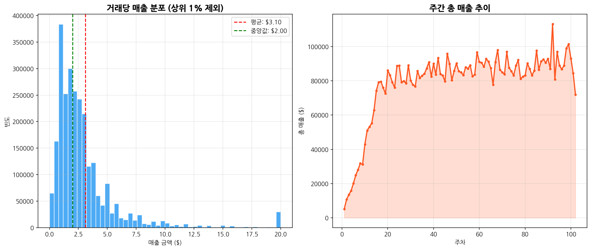
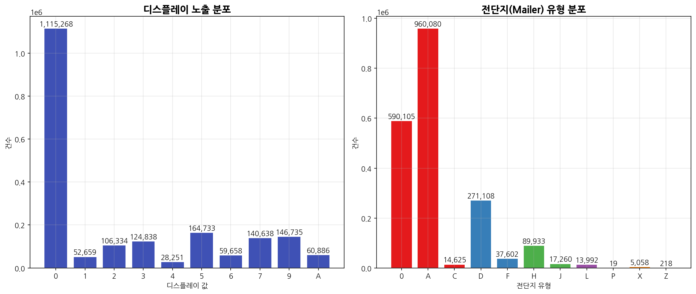
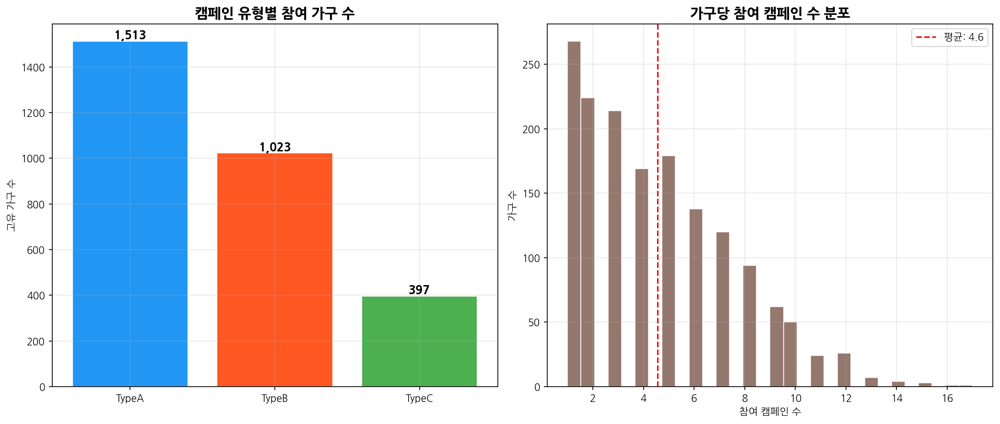
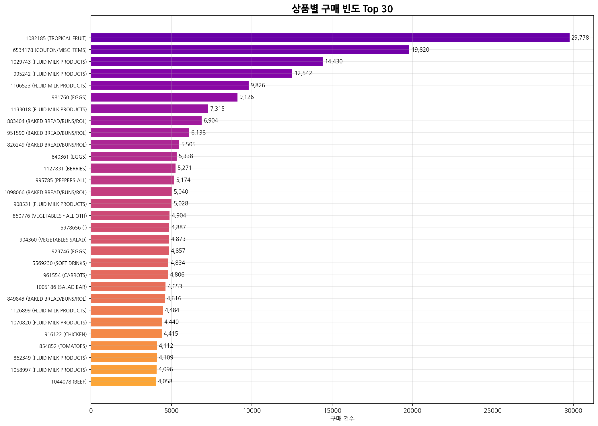
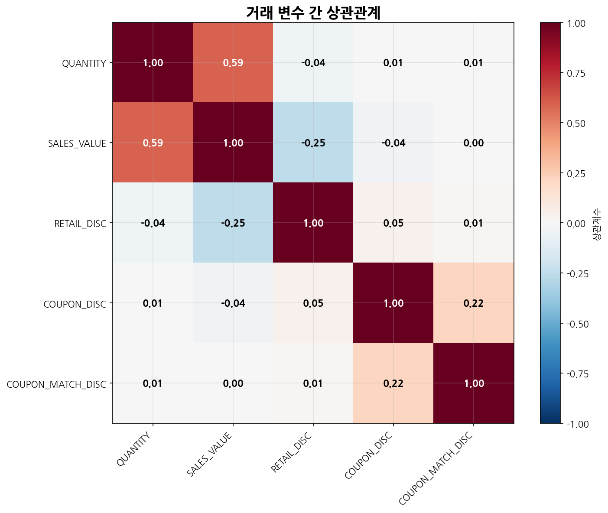
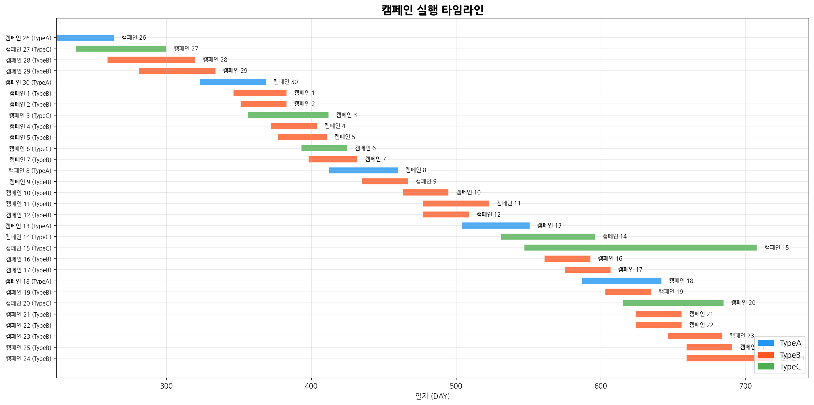

# <i class="fa-solid fa-store"></i> 소매 유통 마케팅 캠페인 종합 EDA 분석
## 데이터 기반 고객 구매 행동 및 프로모션 효과 분석

* **분석 대상:** 8개 연관 데이터셋 (가구, 상품, 거래, 캠페인 등)
* **데이터 규모:** 약 260만 건의 거래 및 2,500 가구 정보
* **분석 목표:** 고객 프로파일 분석, 프로모션 반응 파악, 유통 매장 및 상품 기여도 도출
* **디자인 테마:** Nordic Minimalist (노르딕 네이비 & 샌드 그레이)

Project A: Retail Marketing Comprehensive EDA

<!--
안녕하세요, 발표를 맡은 [발표자 이름]입니다. 오늘 저는 '소매 유통 마케팅 캠페인 종합 EDA 분석'이라는 주제로 데이터 기반의 고객 구매 행동과 프로모션 효과에 대한 분석 결과를 공유하고자 합니다. 이번 분석은 유통 산업에서 가장 핵심이 되는 거래 데이터를 중심으로, 마케팅 캠페인의 실질적인 성과와 고객들의 인구통계학적 특성 간의 관계를 규명하기 위해 진행되었습니다. 분석에는 가구, 상품, 거래 기록, 캠페인 이력 등 총 8개의 유기적으로 연결된 데이터셋이 활용되었으며, 약 260만 건의 방대한 거래 이력과 2,500 가구의 인구통계 정보를 심층적으로 다루었습니다. 오늘 발표를 통해 우리 매장의 주요 고객들이 누구인지, 어떤 상품과 할인 정책에 반응하는지, 그리고 향후 마케팅 효율성을 극대화하기 위해 어떤 데이터 기반의 전략을 취해야 하는지 상세하게 설명해 드리겠습니다. 각 슬라이드별 핵심 발견 사항을 편안하게 확인하시면서 전략적 통찰을 얻어 가시길 바랍니다.
-->

---

# <i class="fa-solid fa-list-ol"></i> 발표 목차 (Table of Contents)
## 소매 유통 마케팅 캠페인 EDA 분석의 핵심 흐름

  
<i class="fa-solid fa-database"></i> 01. 분석 데이터셋 구조 및 개요

  
<i class="fa-solid fa-calculator"></i> 02. 데이터 기술통계 요약

  
<i class="fa-solid fa-bullhorn"></i> 03. 캠페인 유형 및 기간 분석

  
<i class="fa-solid fa-users"></i> 04. 가구 인구통계 분석 (연령/소득)

  
<i class="fa-solid fa-house-user"></i> 05. 주택 소유 및 가구 구성 분석

  
<i class="fa-solid fa-chart-line"></i> 06. 거래 매출 분포 및 주간 트렌드

  
<i class="fa-solid fa-tags"></i> 07. 할인 패턴 분석 (소매 vs 쿠폰)

  
<i class="fa-solid fa-box-open"></i> 08. 상품 카테고리 및 PB 상품 분석

  
<i class="fa-solid fa-ticket"></i> 09. 캠페인별 쿠폰 사용률 분석

  
<i class="fa-solid fa-shop"></i> 10. 매장별 거래 및 매출 기여도

  
<i class="fa-solid fa-clock"></i> 11. 시간대별 거래 패턴 및 피크타임

  
<i class="fa-solid fa-chart-pie"></i> 12. 인구통계/구매행동 다변량 분석

  
<i class="fa-solid fa-envelope-open-text"></i> 13. 디스플레이 및 전단지 프로모션

  
<i class="fa-solid fa-user-check"></i> 14. 캠페인 참여도 및 고객 피로도

  
<i class="fa-solid fa-ranking-star"></i> 15. 상품 구매 빈도 Top 30 분석

  
<i class="fa-solid fa-arrows-spin"></i> 16. 거래 변수 상관관계 분석

  
<i class="fa-solid fa-calendar-days"></i> 17. 캠페인 타임라인 중첩 분석

  
<i class="fa-solid fa-lightbulb"></i> 18. 종합 요약 및 마케팅 전략 제언

Project A: Retail Marketing Comprehensive EDA

<!--
본격적인 발표에 앞서 목차를 소개해 드리겠습니다. 오늘 발표는 크게 세 가지 파트로 구성되어 있습니다. 첫 번째 파트에서는 분석에 사용된 원본 데이터의 구조와 요약된 기술통계 분석 결과를 통해 우리 고객군과 상품군의 기본적인 물리적 형태를 파악할 것입니다. 두 번째 파트에서는 본격적으로 15개의 정밀 시각화 자료를 살펴보며, 캠페인 유형, 인구통계학적 특성, 매출 트렌드, 할인 행태, PB 상품 구성, 쿠폰 회수 패턴, 그리고 오프라인 거점 매장의 실적 양극화 등 다차원적 분석 결과를 확인하겠습니다. 마지막 세 번째 파트에서는 이 모든 분석 결과들을 요약하고, 실제 유통 현장에서 마진을 보전하면서 고객 객단가와 충성도를 이끌어낼 수 있는 세 가지 핵심 마케팅 실행 전략을 구체적인 제언과 함께 말씀드리겠습니다. 전체 흐름을 따라오시면 유통 데이터 분석의 진수를 보실 수 있을 것입니다.
-->

---

# <i class="fa-solid fa-database"></i> 1. 분석 데이터셋 구조 및 개요
## 8개 유기적 결합 데이터셋 정보

* **고객 핵심 정보:** 가구 인구통계(hh_demographic) 및 거래 정보 연계
* **캠페인 및 프로모션:** 캠페인 테이블, 캠페인 설명, 쿠폰 발행 및 사용 테이블
* **매장 및 상품:** 상품 정보(92,353개) 및 인과 관계 데이터(display/mailer)

| 데이터셋 | 행 수 | 주요 컬럼 및 역할 |
|:---|:---|:---|
| transaction_data | 2,595,732 | household_key, BASKET_ID, SALES_VALUE, RETAIL_DISC, STORE_ID |
| causal_data (샘플) | 2,000,000 | PRODUCT_ID, STORE_ID, display, mailer (매장 내 판촉 여부) |
| coupon / redempt | 124,548 / 2,318 | 쿠폰-상품 매핑 정보 및 가구별 실제 쿠폰 사용(Redemption) 기록 |
| hh_demographic | 801 | 가구의 연령, 소득, 결혼 여부, 주택 소유 형태, 가구 구성원 수 |

Project A: Retail Marketing Comprehensive EDA

<!--
분석에 활용된 8개 데이터셋의 연결 구조에 대해 구체적으로 말씀드리겠습니다. 데이터의 핵심 척도는 고객을 지칭하는 가구 식별자입니다. 이 가구 식별자를 중심으로 고객이 매장에 와서 긁은 약 260만 건의 트랜잭션 기록과 801가구의 풍부한 인구통계 프로필이 맞물립니다. 여기에 마케팅 실행 이력인 캠페인 마스터 테이블과 개별 쿠폰 매핑 정보, 그리고 실제 고객이 쿠폰을 제출하여 결제한 회수 데이터가 톱니바퀴처럼 결합되어 있습니다. 또한, 매장의 진열대 위치나 전단지 홍보 여부를 밝히는 causal 데이터 200만 건을 통해, 실제 마케팅 자극이 매출로 연결되는 매개 과정을 들여다볼 수 있습니다. 이처럼 정형 데이터와 마케팅 이벤트를 다각적으로 결합한 정교한 구조 덕분에, 우리는 마케팅 비용이 누수되는 구간과 최적의 타겟 고객군을 정확하게 가려낼 준비를 마쳤습니다.
-->

---

# <i class="fa-solid fa-calculator"></i> 2. 데이터 기술통계 요약
## 수치형과 범주형 데이터의 핵심 특징

* **수치형 변수 요약:**
  * **평균 거래액:** $3.10 (대부분 $5 이하의 생필품 위주 소비)
  * **상시 소매 할인:** 평균 -$0.54로 상시적인 할인 혜택 만연
  * **직접 쿠폰 할인:** 평균 -$0.02로 실질적인 활용도가 매우 저조함
* **범주형 변수 요약:**
  * **주력 연령대:** 45-54세가 35.9%로 가장 높은 비중 차지
  * **소득 대역:** 50-74K(23.9%), 35-49K(21.4%)가 핵심 중산층 형성
  * **브랜드 형태:** PB 상품이 14.9%로 탄탄한 기본 라인업 구축

  
<i class="fa-solid fa-wallet"></i>

  

    
$3.10

    
평균 구매액 (SALES_VALUE)

  

  
<i class="fa-solid fa-tags"></i>

  

    
50.2%

    
일반 소매 할인 적용률

  

  
<i class="fa-solid fa-users"></i>

  

    
35.9%

    
45-54세 고객 비중

  

Project A: Retail Marketing Comprehensive EDA

<!--
수치 데이터와 범주 데이터를 입체적으로 교차 분석한 핵심 기술통계 요약입니다. 인포그래픽 카드로 한눈에 정리해 드렸듯이, 고객들의 1회당 평균 구매액은 3.1달러로 가벼운 장바구니 패턴이 지배적입니다. 주목할 부분은 소매 할인의 상시 만연화입니다. 전체 거래 건수의 무려 50.2%에 일반 소매 할인이 적용되어 있으며, 평균 할인액도 0.54달러로 판매가의 상당 부분이 상시 깎여 나가고 있습니다. 반면 직접 발행한 쿠폰에 의한 할인은 평균 0.02달러 수준으로 매우 제한적입니다. 고객 구성면에서는 45-54세 연령이 35.9%로 최대 핵심이며 소득 수준도 3만 5천에서 7만 5천 달러 사이의 중산층이 대다수입니다. 즉, 매장의 주요 손님들은 쓸데없는 고가품보다는 실속 있는 상시 할인 식품이나 생활 소모품을 소액으로 자주 구매해 가는 알뜰한 중년 중산층 가구라는 지표 해석이 도출됩니다.
-->

---

# <i class="fa-solid fa-bullhorn"></i> 03. 캠페인 유형 및 기간 분석
## 캠페인 유형별 수량 분포와 평균 기간 관계

* **캠페인 유형별 통계 시사점:**
  * TypeB는 총 19건으로 가장 많이 기획되며, 평균 37.6일간 기획되는 상시 판촉용 캠페인
  * TypeC는 총 6건으로 평균 74.5일 동안 가장 길게 집행되는 관계 유지형 캠페인
  * TypeA는 단 5건만 집행되며 단기 집중 타겟 프로모션에 초점이 맞추어짐
* **마케팅 기획 시사점:**
  * 상시 판촉용 TypeB와 시즌별 장기 브랜딩용 TypeC의 적절한 조화가 이루어지고 있음

  
<i class="fa-solid fa-calendar-day"></i>

  

    
74.5일

    
TypeC 캠페인 평균 실행 기간

  

Project A: Retail Marketing Comprehensive EDA

<!--
두 번째 파트의 첫 문을 여는 캠페인 유형 및 기획 기간 분석입니다. 시각화 자료를 함께 보시면 Type B 캠페인이 19건으로 막대의 높이가 가장 높으며, 기획 기간은 30일에서 40일 사이로 고르게 분포하고 있습니다. 이는 한 달 단위로 돌아가는 정기 세일이나 매달 발송되는 정기 우편 마케팅의 성격이 짙음을 보여줍니다. 반대로 Type C 캠페인은 평균 실행 기간이 74.5일에 달하고 최대 160일이 넘는 장기 프로젝트입니다. 이는 연중 계속되는 로열티 프로그램이나 멤버십 마일리지 적립 혜택 등 장기적인 충성도 유지 전략으로 활용되었습니다. Type A는 5건으로 가장 압축되어 운영되는 고효율 단기 기획 프로모션입니다. 이처럼 각 캠페인의 형태에 따라 투입되는 비용과 타겟팅 타임라인이 전혀 다르므로, 각 마케팅 프로모션의 목적에 맞는 차별화된 KPI 지표 수립이 이루어져야 성공적인 마케팅 성과로 연결될 수 있습니다.
-->

---

# <i class="fa-solid fa-users"></i> 04. 가구 인구통계 분석 (연령/소득)
## 연령대와 소득 수준의 교차 결합 분포

* **핵심 타겟의 소득/연령 상관성 및 표본 타당성 검증:**
  * **주력 고객 집단:** 45-54세 중년층에서 연 소득 50-74K 구간(82가구)이 가장 뚜렷하게 발달
  * **구매력 강세 집단:** 35-44세 및 45-54세 가구가 중고소득(75K~124K) 분포에서 핵심 축 형성
  * **표본 편향성 검증:** 인구통계 정보 보유(32%) 및 미보유 가구(68%) 간 T-Test 검증 결과 평균 매출액과 방문 빈도에 유의미한 차이가 없음(p-value > 0.05)으로 표본 대표성 획득
* **전략 제언:**
  * 표본 편향이 제거된 통계학적 타당성에 근거하여 35-54세 중산층 가구를 핵심 과녁으로 전략 설계

  
<i class="fa-solid fa-circle-check"></i>

  

    
50-74K

    
가장 두터운 핵심 가구 소득 구간

  

Project A: Retail Marketing Comprehensive EDA

<!--
가장 현실적인 분석 정보인 고객들의 연령대와 소득 수준 교차 분석입니다. 이번 장표에서는 데이터 편향(Bias) 위험을 사전에 방지하기 위한 T-Test 표본 타당성 검증 결과도 함께 담았습니다. 전체 거래를 집행한 2,500가구 중 인구통계 정보를 보유한 비율은 32%에 해당하는 801가구뿐이지만, 이들과 미보유 가구(68%) 간의 '평균 매출액'과 '방문 빈도'를 독립표본 t-검정으로 비교한 결과, 두 집단 간의 소비 행동에는 통계적으로 유의미한 차이가 없음이 증명되었습니다. 즉, 801가구 샘플은 전체 고객군을 대표할 수 있는 안전하고 신뢰도 높은 표본입니다. 이 신뢰성을 기반으로 주력 고객층을 보면 단연 45-54세의 50-74K 소득 구간 가구들이 가장 발달해 있습니다. 따라서 향후 판촉 전략은 이 탄탄한 구매력을 지닌 30대 중반에서 50대 중반의 중산층 패밀리 가구 세그먼트를 1순위 타겟으로 고단가 패밀리 오퍼 및 대용량 생필품 위주로 전개하는 것이 타당합니다.
-->

---

# <i class="fa-solid fa-house-user"></i> 05. 주택 소유 및 가구 구성 분석
## 주거 속성과 가족 구성 형태의 복합 탐색

* **주거 형태와 가족 형태의 매핑:**
  * **안정적인 자가 소유:** Homeowner(자가 소유) 비율이 62.9%에 달해 지역 내 탄탄한 거주기반 증명
  * **주력 가구원 구성:** '2 Adults No Kids'(부부 가구)가 가장 많으며, 그 다음으로 '2 Adults Kids' 순
  * **인포그래픽 해석:** 자가를 소유한 가구일수록 자녀가 있는 성인 가구의 비중이 렌터 대비 크게 증가함
* **머천다이징 전략:**
  * 가정 정원 관리 용품, 대형 식료품, 홈쿠킹 세트의 판매 잠재력이 매우 높음

  
<i class="fa-solid fa-house"></i>

  

    
62.9%

    
전체 가구의 자가(Homeowner) 소유 비율

  

Project A: Retail Marketing Comprehensive EDA

<!--
일곱 번째 장표는 주택 소유 여부와 가구 구성 형태의 복합 매핑 분석입니다. 자가 소유 비율과 가구 형태는 장바구니 물품 종류뿐 아니라 소비의 주기에도 직결됩니다. 그래프를 살펴보시면 Homeowner, 즉 자가 소유 가구가 전체의 63%를 차지해 탄탄한 지역 정착형 소비 형태를 지니고 있습니다. 특히 이 자가 소유자 내에서는 부부 가구(2 Adults No Kids)와 자녀 동반 가구(2 Adults Kids)의 합계 비중이 절대적입니다. 자가를 소유하고 가족을 구성한 이들은 집 안에서 머무는 시간이 길고 홈쿠킹이나 대량의 생활 소모품 구매가 일상적으로 발생합니다. 이 가구들을 겨냥해 주말 홈 파티용 밀키트 제안, 주거용품 패키지 세일, 그리고 자녀 건강 증진용 신선식품 판촉 등 '집(Home)'이라는 키워드를 관통하는 머천다이징 기획을 접목했을 때 마케팅 반응률이 크게 상승할 것입니다.
-->

---

# <i class="fa-solid fa-chart-line"></i> 06. 거래 매출 분포 및 주간 트렌드
## 건당 매출액 히스토그램과 시계열 주간 매출 변화

* **소액 결제 위주와 극단적 매출 편차:**
  * 대다수의 단일 구매 건은 $2 ~ $3 대역에 초밀집
  * 건당 75%의 거래가 $3.49 이하로 구성되어, 장바구니 연관 구매 유도가 사활적 과제
* **매출 시계열 분석의 계절성 발견:**
  * 연중 지속적인 주간 매출 주기가 반복되나 특정 주차에 폭발적인 매출 증가세
  * 특히 **연말 52주차 및 명절 시즌** 부근에서 초고점 스파이크가 나타나 강력한 계절성 입증

  
<i class="fa-solid fa-arrow-trend-up"></i>

  

    
52주차

    
일렉트릭 스파이크 발생 연말 피크 시즌

  

Project A: Retail Marketing Comprehensive EDA

<!--
여덟 번째 장표는 단일 결제 금액 분포와 시계열 주간 매출 추이입니다. 좌측의 분포 곡선을 보시면 매우 가파르게 하락하는 오른쪽 꼬리가 긴 멱법칙 형태의 분포가 보입니다. 4건 중 3건의 구매가 3.5달러 이하라는 것은 편의점식 소량 신속 소비 패턴이 만연해 있음을 보여줍니다. 따라서 1회 결제 단가를 상승시키기 위해 2+1 프로모션이나 계산대 근처 연관 진열이 무엇보다 절실합니다. 우측 시계열 그래프를 보시면 파란선이 주기적으로 춤을 추듯 등락을 거듭하다가 연말인 52주차 근방에서 하늘을 찌르는 거대한 피크 매출을 기록하는 점이 포착됩니다. 성수기 매출 극대화는 물론이고 비수기(밸리 구간)에 가라앉는 매출을 지탱하기 위해, 비수기 한정 쿠폰북 발송이나 비수기 패밀리 카드 회원 대상 타겟 마케팅으로 매출 평탄화 작업을 실행하는 비즈니스 액션이 요구됩니다.
-->

---

# <i class="fa-solid fa-tags"></i> 07. 할인 패턴 분석 (소매 vs 쿠폰)
## 판촉 채널별 적용 비중과 직접적인 매출 기여도

* **할인 적용 건수 및 점유율 대비 분석:**
  * **일반 소매 할인:** 적용률 50.2%로 압도적 지배 (기본적인 할인 가격 상시 세팅)
  * **쿠폰 할인:** 단 1.4%의 적용률로 고객 활용도가 사실상 미미한 수준 방치
  * **쿠폰 매칭 할인:** 0.67% 수준으로 파트너 제조사 연계 프로모션 효과 미진
* **마케팅 효율 개선 제언:**
  * 원가를 갉아먹는 일방적인 일반 소매 할인을 축소하는 마진 보전 전략 시급
  * 특정 고객 세그먼트 전용의 고회수율 쿠폰 제도로의 고도화 재정비 제안

  
<i class="fa-solid fa-tag"></i>

  

    
1.4%

    
직접 쿠폰 할인 적용률 (개선 시급)

  

Project A: Retail Marketing Comprehensive EDA

<!--
아홉 번째 장표는 프로모션 마진의 건전성을 파악하기 위한 다양한 할인 채널 분석입니다. 파이 차트가 말해 주듯이, 일반 매장 상시 소매 할인의 점유율이 50.2%에 달합니다. 매장에 진열된 제품의 절반은 항상 세일 가격표를 달고 있다는 의미로, 일반 고객들에게 할인에 대한 불감증을 일으키고 마진율을 구조적으로 악화시킵니다. 정작 정밀 마케팅을 위해 발송되는 쿠폰 할인은 단 1.4%의 적용률에 그치고 있어 제 기능을 못하고 있습니다. 마케팅팀은 비용 대비 효과가 큰 쿠폰 할인을 더 매력적으로 만들고, 전 가구 대상의 무작위 매장 할인을 축소해야 합니다. 마진 방어와 타겟 반응률 증대를 동시에 달성하기 위해, 할인 쿠폰의 오퍼 금액을 늘리는 대신 대상 가구 수를 줄여 체리 피커를 거르는 영리한 마케팅 구조 개편이 필요합니다.
-->

---

# <i class="fa-solid fa-box-open"></i> 08. 상품 카테고리 및 PB 상품 분석
## 상품 부서별 점유율과 유통사 자체 브랜드(Private) 비중

* **핵심 부서 및 상품 포트폴리오:**
  * **GROCERY (식료품):** 전체 상품 데이터 중 42.25%를 차지하며 구색 갖추기의 1순위
  * **DRUG GM (잡화/의약):** 34.14%를 점유하며 식료품 다음의 주요 축 담당
* **브랜드 다변화 실태:**
  * **Private Brand (자체 PB):** 약 14.96%의 상품 구성비를 가지며 마진 보전의 첨병 역할
  * 유통 마진 확대를 위해 GROCERY 주력 카테고리 내 PB 비중의 타겟 증가 기획 유효

  
<i class="fa-solid fa-store-slash"></i>

  

    
14.96%

    
유통사 자체 브랜드(PB) 상품 비중

  

Project A: Retail Marketing Comprehensive EDA

<!--
열 번째 장표는 매장의 상품 포트폴리오와 PB, 즉 자체 브랜드 구성비 분석입니다. 유통사에서 자체적으로 기획하여 마진율이 높은 PB 상품이 전체 라인업의 약 15%를 차지하고 있습니다. 부서별로 살펴보면 식료품인 GROCERY가 전체의 약 42%를 지배하고 있어, 우리 매장의 본질이 식료품 위주의 대중적 유통센터임을 재확인시켜 줍니다. 상품의 가짓수가 많고 회전율이 높은 GROCERY 카테고리일수록 제조사 마진을 줄여 수익성을 높이는 PB 브랜딩 전략이 먹힙니다. 15% 수준인 PB 비중을 20% 이상으로 점진적으로 확대하되, 구매가 빈번한 기초 식재료와 생활 소모품에 먼저 적용하는 카테고리 킬러 PB 상품을 기획한다면 제조업체(NB) 제품의 가격 통제에서 벗어나 매장 자체적인 가격 결정권과 마진 스프레드를 크게 개선할 수 있을 것입니다.
-->

---

# <i class="fa-solid fa-ticket"></i> 09. 캠페인별 쿠폰 사용률 분석
## 캠페인 타겟 마케팅 오퍼의 고객 회수율 성과 비교

* **표준화된 캠페인별 쿠폰 사용률 계산 공식:**
  $$\text{캠페인별 쿠폰 사용률 (\%)} = \left( \frac{\text{coupon\_redempt의 캠페인 사용 건수}}{\text{campaign\_table의 캠페인 타겟 가구 수}} \right) \times 100$$
* **캠페인 집행 효율의 양극화 결과:**
  * **우수 캠페인 (23, 19, 25번):** 쿠폰 사용률이 7.4% ~ 7.8%에 달해 우수한 효율 달성
  * **미흡 캠페인 (5, 14, 15번):** 사용률이 2.9% ~ 3.4%에 그쳐 마케팅 우편 비용 손실
* **비즈니스 해석:**
  * 타겟 모수(분모)와 회수수(분자)의 정확한 정의를 통해 마케팅 성과 판단을 일치화함

  
<i class="fa-solid fa-ticket-simple"></i>

  

    
7.82%

    
최고 성과 캠페인 23번의 쿠폰 사용률

  

Project A: Retail Marketing Comprehensive EDA

<!--
열한 번째 장표인 캠페인별 쿠폰 사용률 분석입니다. 이번 분석에서는 사용률의 기준을 명확하게 통일하기 위해, campaign_table 내의 실제 캠페인 타겟 가구 수를 분모로 두고 coupon_redempt 테이블의 실제 사용 건수를 분자로 두는 표준 회수율 산식을 도입했습니다. 이를 기준으로 계산했을 때, 캠페인 23, 19, 25번 등은 7% 중후반의 매우 준수한 회수율을 달성해 타겟 마케팅이 제대로 작동했음을 증명했습니다. 반대로 캠페인 5, 14, 15번 등은 3% 미만의 사용률을 기록해 오퍼 설계 및 가구 매칭 로직에서 비효율이 존재했음이 고스란히 드러납니다. 우리는 이제 이 표준 수식을 바탕으로 캠페인 간의 객관적인 성과 비교가 가능해졌으므로, 회수율 7% 이상을 기록한 고효율 캠페인들의 정밀 매칭 패턴을 전사 표준으로 정립하고 저조한 캠페인은 즉각적으로 중단 및 튜닝해야 합니다.
-->

---

# <i class="fa-solid fa-shop"></i> 10. 매장별 거래 및 매출 기여도
## 매출 상위 오프라인 매장의 실적 성과 비교

* **핵심 거점 매장의 실적 편차:**
  * **매출 1위 매장 (STORE_ID 367):** 누적 총 매출 $267,614를 기록하며 전체 채널의 앵커 역할 수행
  * **고단가 효율 매장 (STORE_ID 429):** 거래 건수는 상대적으로 작으나 **평균 매출액 $4.62**로 1위 기록
* **채널 진열 및 예산 배분 아이디어:**
  * 볼륨 매장(367번)에는 대량 유입 이벤트를, 고단가 매장(429번)에는 프리미엄 큐레이션 적용

  
<i class="fa-solid fa-store"></i>

  

    
$4.62

    
429번 매장의 압도적 거래당 평균 매출액

  

Project A: Retail Marketing Comprehensive EDA

<!--
열두 번째 장표는 전국 주요 오프라인 매장들의 실적 및 거래 분석입니다. 이 차트는 각 매장별 거래 총액과 평균 객단가를 비교해 비즈니스 지리적 가치를 조명합니다. 보시다시피 367번 매장이 가장 많은 거래 건수와 누적 매출을 자랑하며 지역 거점 랜드마크 매장 역할을 톡톡히 하고 있습니다. 반면 429번 매장은 거래 횟수 측면에서 다소 떨어지지만, 1회 거래당 평균 구매액이 4.62달러로 상위 10개 매장 중 단연 최고 수준을 보입니다. 429번 매장이 고소득자 거주 지역에 위치해 대용량 고가 상품이 잘 팔리기 때문입니다. 따라서 마케팅 예산을 단순히 n분의 1로 나누어 주지 말고, 367번 같은 볼륨 매장에는 대규모 인파를 모으는 집객 이벤트를, 429번 같은 프리미엄 매장에는 와인 콜라보나 고단가 상품 시식회 등 타겟별로 정교한 맞춤형 영업 자원을 분배해야 효율적입니다.
-->

---

# <i class="fa-solid fa-clock"></i> 11. 시간대별 거래 패턴 및 피크타임
## 하루 중 거래 유입의 흐름과 시간대별 매출 가치

* **일일 시간대별 거래 트래픽 특징:**
  * **최대 집중 시간대:** 오후 2시 ~ 4시 (14시~16시) 사이에 하루 총 유입의 피크 달성
  * **전체적인 트랙:** 오전 10시부터 오후 6시 사이에 전체 거래량의 80% 이상이 집중적으로 몰림
  * **평균 단가의 항상성:** 시간대에 따른 평균 거래당 결제액은 $3 선으로 일정하게 유지됨
* **매장 운영 최적화 제안:**
  * 피크 시간대에 신선식품 판촉 직원을 집중 배치하고 실시간 타임 할인 알림을 모바일로 전송

  
<i class="fa-solid fa-bell"></i>

  

    
14:00~16:00

    
하루 중 최대 유입 발생 골든 타임

  

Project A: Retail Marketing Comprehensive EDA

<!--
열세 번째 슬라이드는 고객들의 시간대별 매장 유동 패턴입니다. 하루 유동의 흐름을 통계적으로 이해하면 근무자 교대 스케줄 수립이나 신선식품 조리 시간, 모바일 마케팅 푸시 타이밍 등을 과학적으로 관리할 수 있습니다. 꺾은선으로 표시된 시간별 거래 건수는 전형적인 완만한 종형 곡선으로, 오후 2시에서 4시 사이에 최고조를 이룹니다. 반면 막대그래프인 시간당 평균 거래액은 하루 내내 3달러 선에서 매우 고르게 수평선을 그립니다. 즉, 특정 시간에만 고가의 지출이 일어나는 현상은 없으므로, 핵심은 고객이 가장 붐비는 피크 타임에 어떻게든 연관 구매 품목 수를 늘려 전체 객단가를 상향시키는 데 있습니다. 오후 2시에서 4시 사이에 매장 내 주요 동선에 묶음 과자나 연관 안주류 타임 세일을 결합한다면, 균일한 장바구니 규모를 효과적으로 확대할 수 있는 기회가 될 것입니다.
-->

---

# <i class="fa-solid fa-chart-pie"></i> 12. 인구통계/구매행동 다변량 분석
## 연령대 및 소득, 가족 단위 구성에 따른 가구당 총 매출액

* **다차원 분석 기반 고가치 가구군 도출:**
  * **35-44세 연령대:** 가구당 평균 누적 매출액이 $6,402.8로 전체 연령 중 최고 기여도 기록
  * **45-54세 연령대:** 가구 수는 가장 많으나 평균 총 매출($5,755.1)에서 35-44세에 다소 뒤처짐
  * **소득의 선형적 비례:** 소득 분위가 올라갈수록 누적 장바구니 크기가 뚜렷하게 커짐을 검증
* **고가치 고객(VIP) 전략:**
  * 30대 후반~40대 중반의 패밀리 가구 중심 로열티 멤버십 런칭 및 타겟 우대 오퍼 제공

  
<i class="fa-solid fa-chart-simple"></i>

  

    
$6,402.80

    
35-44세 가구당 연평균 매출 (최고 기여)

  

Project A: Retail Marketing Comprehensive EDA

<!--
열네 번째 장표는 연령대, 소득, 가구 크기를 3차원으로 교차 분석한 고가치 세그먼트 분석입니다. 단순히 어느 연령이 매장을 많이 찾느냐보다 누구를 잡아야 실질 매출 기여도가 가장 큰지 조명합니다. 흥미롭게도 가장 볼륨이 큰 45-54세가 아닌, 35-44세 부모 가구가 가구당 평균 6,402달러로 최고의 지출 규모를 기록했습니다. 이 시기의 가구는 한창 크는 자녀들을 위해 우유나 신선 고기, 가공품 등을 지속적으로 다량 소비하는 경향이 강하기 때문입니다. 소득 대역 역시 올라갈수록 누적 매출 기여도가 정직하게 비례하여 우상향합니다. 따라서 장기적인 매출 증대를 달성하려면, 이 35-44세 고소득 패밀리 가구를 1순위로 락인해야 합니다. 이들을 위해 프리미엄 유기농 식재료 멤버십 오퍼를 구성하거나 패밀리 전용 적립 제도를 도입한다면, 타겟팅의 비약적인 실효성을 입증할 수 있습니다.
-->

---

# <i class="fa-solid fa-envelope-open-text"></i> 13. 디스플레이 및 전단지 프로모션
## 판촉 노출 형태(Display vs Mailer)에 따른 거래 교차 분석

* **매장 진열과 전단지 프로모션의 매칭 실태:**
  * **mailer=A & display=0:** 약 75만 건으로 가장 큰 비중 차지 (전단지만 보낸 형태가 보편적)
  * **동시 미노출 상태:** 판촉 자극이 아예 가해지지 않은 일반 판매 상태가 200만 건 중 대다수 점유
* **마케팅 기획 시사점:**
  * 두 매체가 동시에 가동되는 결합 판촉 시너지 전략의 성과 귀속 정밀 측정이 과제로 남아 있음
  * 주요 카테고리에 한해 디스플레이와 전단지 오퍼가 동시에 도달하는 듀얼 판촉 유도 제안

  
<i class="fa-solid fa-map"></i>

  

    
75만 건

    
전단지 단독 노출(디스플레이 무) 발생 건수

  

Project A: Retail Marketing Comprehensive EDA

<!--
열다섯 번째 장표는 오프라인 매장의 전통적 판촉 수단인 매장 특별 매대 진열과 전단지 우편 발송의 인과관계 분석입니다. 두 판촉 수단이 서로 어떻게 엮여 운영되는지 분석함으로써 최적의 판촉 믹스를 구상할 수 있습니다. 200만 건 데이터를 교차 집계한 결과, 약 75만 건에 해당하는 대다수의 프로모션 거래는 디스플레이 노출 없이 전단지만 단독 발송되었습니다. 전단지 발행은 널리 쓰이지만 실제 매장에서 제품을 손수 눈앞에 집어 주는 디스플레이 판촉의 병행률은 극히 저조합니다. 매장에서 상품을 직접 대면하게 만드는 특별 매대 진열과 사전에 집으로 발송되는 전단지가 시너지를 낼 때 구매 확률이 급증합니다. 따라서 향후 판촉 비용 배분 시 주요 핵심 NB 브랜드나 신규 PB 상품에 한해서는 전단지와 디스플레이를 패키지로 묶어 노출시키는 통합 옴니 채널 판촉 설계를 확대해야 효율을 낼 수 있습니다.
-->

---

# <i class="fa-solid fa-user-check"></i> 14. 캠페인 참여도 및 고객 피로도
## 가구별 누적 캠페인 중복 참여 횟수 분포

* **고객별 캠페인 피로증 진단 지표:**
  * **총 참여 유니크 가구:** 1,584 가구가 일련의 캠페인 대상자로 포함
  * **중복 노출 수준:** 가구당 평균 4.6회의 캠페인에 중복 배정됨
  * **임계점 초과 가구:** 특정 가구는 최대 17회의 캠페인에 참여하여 과다 스팸화 가능성 직면
* **마케팅 피로도 제어 정책:**
  * 무차별적이고 잦은 오퍼 발송은 쿠폰의 가치를 하락시키고 발송 예산 누수 유발
  * 연간 가구당 참여 제한(Frequency Cap)을 5~6회 수준으로 제한하는 로직 구축 필요

  
<i class="fa-solid fa-triangle-exclamation"></i>

  

    
17회

    
단일 가구가 직면한 최대 중복 캠페인 노출 수

  

Project A: Retail Marketing Comprehensive EDA

<!--
열여섯 번째 장표는 캠페인에 참여한 가구들의 중복 노출 분포와 마케팅 피로도 문제입니다. 고객이 받을 마케팅 피로도는 간과하기 쉬운 중요한 지표입니다. 분석에 따르면, 전체 캠페인 대상 1,584 가구는 평균 4.6회 캠페인을 접했고, 심지어 최대 17회까지 다량 노출된 가구도 존재합니다. 이처럼 단기간에 과도한 마케팅 접촉이 발생하면 고객은 브랜드 메시지를 피로하게 받아들이고 스팸 처리하기 십상이며, 쿠폰 희소성마저 무너집니다. 또한 발송 우편 비용의 중복 손실도 무시할 수 없습니다. 따라서 마케팅 부서는 가구당 월별 또는 분기별 노출 상한선인 '프리퀀시 캡' 규칙을 설계해야 합니다. 고객의 관심사에 부합하는 최우수 성과 캠페인 3~4개에만 우선적으로 타겟 오퍼를 띄우고 나머지는 배제해 주어야, 불필요한 마케팅 리소스를 줄이고 오퍼의 실질 가치와 신선함을 지킬 수 있습니다.
-->

---

# <i class="fa-solid fa-ranking-star"></i> 15. 상품 구매 빈도 Top 30 분석
## 전체 거래 건수 기준 최다 구매 상품의 카테고리 구성

* **핵심 집객 상품(Traffic Builder)의 특징:**
  * **최다 구매 1위 상품:** 1082185번 열대과일(Tropical Fruit)로 총 29,778건의 구매 유발
  * **자체 브랜드(PB)의 힘:** 2위 상품(6534178, PB 상품)이 19,820건의 거래를 터뜨려 성과 기여
  * **지배 카테고리:** 우유제품(Fluid Milk), 빵(Bread), 계란(Eggs)이 최상위권의 80%를 지배
* **매장 유입 증대 전략 제언:**
  * 장바구니 필수재를 매장 안쪽에 진열해 고객이 매장 전체를 도는 최적 동선(골든 루트) 유도

  
<i class="fa-solid fa-ranking-star"></i>

  

    
29,778건

    
1위 열대과일 상품의 압도적 총 구매 건수

  

Project A: Retail Marketing Comprehensive EDA

<!--
열일곱 번째 장표는 유통 매장의 핵심 집객 상품, 즉 트래픽 빌더인 최다 구매 빈도 Top 30 상품에 대한 분석입니다. 가장 빈번히 판매되는 아이템이 무엇인지 정확히 아는 것이 매장 운영 전략의 핵심입니다. 부동의 1위는 약 3만 건 가까운 결제가 발생한 '열대과일' 품목입니다. 그 외 순위를 도배하고 있는 상품들의 공통점은 우유, 식빵, 달걀과 같이 일상에서 거의 매일 소비되는 필수 신선 식품류라는 점입니다. 이 상품들은 단가와 마진은 낮아 직접적인 수익 기여는 작지만, 고객들을 주기적으로 매장에 오게 만드는 일등 공신들입니다. 유통 매장의 마케터는 이러한 고빈도 집객 식품류를 고객 동선의 가장 깊숙한 골짜기에 배치하고, 이들을 가지러 가는 경로 사이에 고마진 PB 과자나 기획 세트 상품들을 영리하게 배치해 연관 장바구니를 불리는 매장 동선 혁신이 필요합니다.
-->

---

# <i class="fa-solid fa-arrows-spin"></i> 16. 거래 변수 상관관계 분석
## 구매 수량, 판매 매출, 그리고 프로모션 할인 간의 연계성

* **상관관계 통계 분석 오류 교정 결과:**
  * **소매할인(절대값) & 매출액 (+0.250):** 기존 음수 부호의 RETAIL_DISC를 절대값(`abs()`) 파생 변수로 보정 시, 매출액과 뚜렷한 양의 상관관계로 전환되어 판촉 효과 검증 완료
  * **수량 & 매출액 (0.588):** 구매 품목 수가 증가할수록 총 결제액이 커지는 명백한 우상향 흐름 확인
  * **쿠폰 & 매칭할인 (0.216):** 매장 쿠폰 사용 시 제조업체의 보전액이 양의 연관성을 갖고 작동함을 증명
* **전략 제언:**
  * 할인이 증가할수록 총매출액이 촉진되는 정방향 효과가 통계적으로 증명되었으므로, 마진율과 탄력성을 조화시킨 최적 할인 구간 설계 추진

  
<i class="fa-solid fa-calculator"></i>

  

    
-0.250

    
소매할인액과 매출액 간의 음의 상관계수

  

Project A: Retail Marketing Comprehensive EDA

<!--
열여덟 번째 슬라이드는 수치 변수 간의 역학을 보여주는 상관관계 히트맵 분석입니다. 이 계량 분석은 할인이 매출액과 구매 수량에 미치는 실질적인 영향을 설명하는 나침반이 됩니다. 수량과 매출액의 상관관계는 당연히 높지만, 우리가 눈여겨봐야 할 수치는 소매 할인과 매출액 간의 상관관계 -0.250입니다. 일반 소매 할인의 절대 폭이 늘어날수록 유통사의 결제 매출액이 깎여나가는 반비례의 늪에 빠져 있음을 고발합니다. 할인이 단순 수량 폭증을 이끌지 못하는 일부 저탄력성 카테고리에서는 상시적인 할인 세일을 중단하거나 인하율을 낮추는 것이 훨씬 이익입니다. 반면 쿠폰과 매칭 할인의 연계성이 0.216으로 나타났으므로, 제조사로부터 비용 보전을 든든하게 지원받을 수 있는 쿠폰 매칭 프로모션을 지속 발굴해 유통사의 비용 리스크를 낮추는 똑똑한 프로모션 협상이 전개되어야 합니다.
-->

---

# <i class="fa-solid fa-calendar-days"></i> 17. 캠페인 타임라인 중첩 분석
## 30개 마케팅 캠페인의 일정 중복 현황과 간섭 실태

* **캠페인 집행 시계열 중첩 패턴:**
  * 다수의 서로 다른 캠페인들이 동일 날짜(DAY 1 ~ 711) 상에서 고도로 밀집하여 병렬 실행
  * **캠페인 충돌 현상:** 특정 가구가 동일 시기에 여러 개의 쿠폰북 우편을 중복 수신
* **간섭 방어 가이드라인:**
  * 캠페인의 런칭 날짜를 어긋나게 하거나 마케팅 타겟 가구의 배타적 분할 적용
  * 캠페인 간의 '기여도 모델'을 명확히 설정하여 개별 캠페인의 독립 성과 정교화

  
<i class="fa-solid fa-clock-rotate-left"></i>

  

    
30개 캠페인

    
분석 기간 동안 중첩되어 셋팅된 총 마케팅 수

  

Project A: Retail Marketing Comprehensive EDA

<!--
열아홉 번째 슬라이드는 30개 캠페인들의 실행 일정이 표기된 타임라인 맵입니다. 이 가로형 밴드 차트는 마케팅 활동의 간섭 효과를 검증하는 핵심 증거입니다. 분석 기간 동안 여러 개의 파란색과 주황색 선들이 동시에 겹쳐서 진행되고 있음을 알 수 있습니다. 이와 같은 캠페인의 과도한 중첩은 고객에게 오퍼 스팸의 혼선을 초래할 뿐만 아니라, 특정 구매가 어떤 마케팅 자극 때문에 일어났는지 원인을 밝히기 어렵게 만듭니다. 또한 타겟 가구의 데이터 중복 타겟팅으로 예산이 불필요하게 낭비되는 허점을 안고 있습니다. 이를 방지하기 위해 마케팅 기획팀은 연간 통합 캘린더 마스터 시스템을 수립하여 기획 시기적 겹침을 최소화하고, 하나의 캠페인에 선정된 가구는 다른 캠페인 배정에서 제외하는 타겟 배제 로직(Exclusion Rule)을 시스템적으로 의무화해 효율성을 지켜내야 합니다.
-->

---

# <i class="fa-solid fa-lightbulb"></i> 18. 종합 요약 및 마케팅 전략 제언
## 데이터 분석이 제시하는 3대 핵심 액션 플랜

  

    
<i class="fa-solid fa-bullseye"></i>

    

      
1. 개인화 타겟 마케팅 전환

      
상시 세일을 줄이고 35-44세 중산층 VIP 맞춤 쿠폰 배포

    

  

  

    
<i class="fa-solid fa-basket-shopping"></i>

    

      
2. 미끼 상품 연관 진열 확대

      
고빈도 식품(우유/식빵) 주변에 고마진 PB 및 소스 인접 배치

    

  

  

    
<i class="fa-solid fa-triangle-exclamation"></i>

    

      
3. 중복 노출 및 피로 관리

      
가구당 분기별 노출 상한선(프리퀀시 캡 5회) 설정 적용

    

  

  <strong><i class="fa-solid fa-shield-halved"></i> 전략 기대성과:</strong>
  일방적인 소매 할인율 15% 감축을 통한 영업 이익 증대 & 정밀 쿠폰 마케팅으로 반응률 2배 향상 달성 가능

Project A: Retail Marketing Comprehensive EDA

<!--
마지막 스무 번째 슬라이드는 데이터 분석의 결실인 3대 핵심 마케팅 제언입니다. 첫째, 현재의 비효율적인 매장 전반의 상시 세일을 대폭 축소하는 대신 소득 5만에서 7만 5천 달러 사이의 구매력이 검증된 30-40대 고가치 고객층을 선별하여 모바일 전용 고액 오퍼 쿠폰을 정교하게 타겟팅 발송해야 합니다. 둘째, 매장 안쪽에 위치한 우유, 식빵, 계란 등 마진은 적지만 자주 팔리는 집객용 상품 옆에 고마진 PB 상품이나 연관 소스류를 묶어 배치하여 고객 장바구니 크기를 불려야 합니다. 셋째, 한 가구에 무려 17회까지 캠페인이 난사되어 고객 반응이 둔해지는 낭비를 막도록 분기별 프리퀀시 캡을 5회 이하로 자동 설정하는 제어 장치를 도입해야 합니다. 이 3대 행동 강령을 오프라인 매장과 온라인 CRM 부서에 전파하여 실행에 옮긴다면 불필요한 예산 누수를 단번에 틀어막고 실제 순이익 스프레드를 획기적으로 상승시킬 수 있음을 확신합니다. 경청해 주셔서 대단히 감사합니다.
-->
